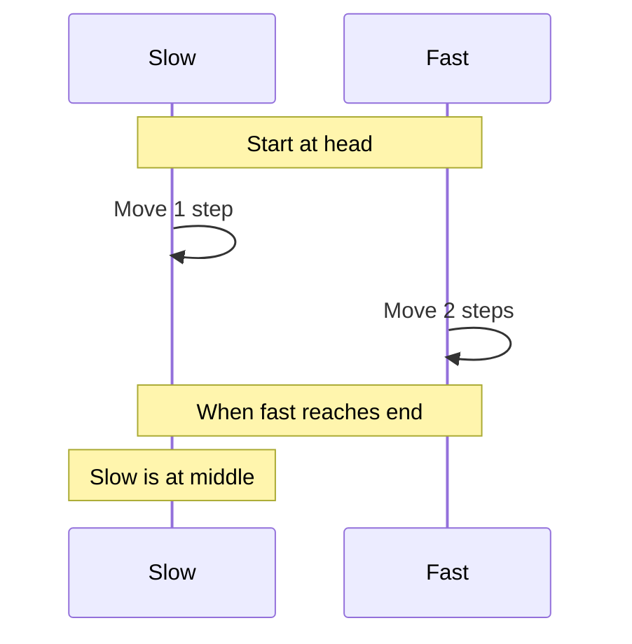

# 📘 **PROBLEM SOLVING MASTERY - Lesson 5: Linked Lists**

**Date**: 23-03-26
**Level**: 🟢 Beginner → 🔴 FAANG Ready
**Series**: DSA & Interview Preparation
**Time**: 90 minutes
**Prerequisites**: Lesson 1-4 (Fundamentals, Arrays, Hashing, Recursion)
- [LastRead](#lastRead)
---

## 🎯 **LEARNING OBJECTIVES**

After completing this **comprehensive** lesson, you will:

1. ✅ **Master Linked List Fundamentals** - Singly, doubly, circular lists
2. ✅ **Master Fast/Slow Pointer Pattern** - Middle, cycle detection, palindrome
3. ✅ **Master Reversal Patterns** - Full, partial, k-group, recursive
4. ✅ **Master Merge Patterns** - Two sorted lists, merge sort
5. ✅ **Handle Advanced Operations** - Remove Nth from end, reorder, rotate
6. ✅ **Solve FAANG Problems** - Real interview questions with detailed solutions

---

## 📦 **PART 1: LINKED LIST FUNDAMENTALS**

### **Linked List Structure**

```mermaid
graph LR
    subgraph "Singly Linked List"
        A1[Head] --> A2[Node 1<br/>data | next]
        A2 --> A3[Node 2<br/>data | next]
        A3 --> A4[Node 3<br/>data | next]
        A4 --> A5[null]
        
        style A1 fill:#4ecdc4
        style A2 fill:#ffe66d
        style A3 fill:#ffe66d
        style A4 fill:#ffe66d
        style A5 fill:#ff6b6b
    end

    subgraph "Doubly Linked List"
        B1[Head] <--> B2[Node<br/>prev | data | next]
        B2 <--> B3[Node<br/>prev | data | next]
        B3 <--> B4[null]
        
        style B1 fill:#4ecdc4
        style B2 fill:#95e1d3
        style B3 fill:#95e1d3
    end

    subgraph "Circular Linked List"
        C1[Head] --> C2[Node 1]
        C2 --> C3[Node 2]
        C3 --> C4[Node 3]
        C4 --> C1
        
        style C1 fill:#4ecdc4
        style C2 fill:#ffe66d
        style C3 fill:#ffe66d
        style C4 fill:#ffe66d
    end
```

---

### **Node Definition**

```javascript
// ─────────────────────────────────────────────
// SINGLY LINKED LIST NODE
// ─────────────────────────────────────────────
class ListNode {
  constructor(val = 0, next = null) {
    this.val = val;
    this.next = next;
  }
}

// ─────────────────────────────────────────────
// DOUBLY LINKED LIST NODE
// ─────────────────────────────────────────────
class DoublyListNode {
  constructor(val = 0, prev = null, next = null) {
    this.val = val;
    this.prev = prev;
    this.next = next;
  }
}

// ─────────────────────────────────────────────
// CREATE LINKED LIST FROM ARRAY
// ─────────────────────────────────────────────
function createList(arr) {
  if (arr.length === 0) return null;
  
  const head = new ListNode(arr[0]);
  let current = head;
  
  for (let i = 1; i < arr.length; i++) {
    current.next = new ListNode(arr[i]);
    current = current.next;
  }
  
  return head;
}

// ─────────────────────────────────────────────
// CONVERT LINKED LIST TO ARRAY
// ─────────────────────────────────────────────
function listToArray(head) {
  const result = [];
  let current = head;
  
  while (current) {
    result.push(current.val);
    current = current.next;
  }
  
  return result;
}

// ─────────────────────────────────────────────
// PRINT LINKED LIST
// ─────────────────────────────────────────────
function printList(head) {
  const values = [];
  let current = head;
  
  while (current) {
    values.push(current.val);
    current = current.next;
  }
  
  console.log(values.join(' → '));
}

// Usage
const list = createList([1, 2, 3, 4, 5]);
printList(list);  // "1 → 2 → 3 → 4 → 5"
```

---

## 📦 **PART 2: FAST & SLOW POINTER PATTERN**

### **The Two Pointer Technique**



---

### **Finding Middle Element**

```javascript
// ─────────────────────────────────────────────
// MIDDLE OF LINKED LIST - LeetCode 876
// ─────────────────────────────────────────────
function middleNode(head) {
  let slow = head;
  let fast = head;
  
  while (fast && fast.next) {
    slow = slow.next;        // 1 step
    fast = fast.next.next;   // 2 steps
  }
  
  return slow;  // Middle node
}

// For even length: returns second middle
// [1,2,3,4,5,6] → returns node with value 4

// ─────────────────────────────────────────────
// FIND FIRST MIDDLE (for even length)
// ─────────────────────────────────────────────
function firstMiddleNode(head) {
  let slow = head;
  let fast = head.next;  // Start fast one step ahead
  
  while (fast && fast.next) {
    slow = slow.next;
    fast = fast.next.next;
  }
  
  return slow;  // First middle for even length
}

// [1,2,3,4,5,6] → returns node with value 3
```

---

### **Cycle Detection**

```javascript
// ─────────────────────────────────────────────
// LINKED LIST CYCLE - LeetCode 141
// ─────────────────────────────────────────────
function hasCycle(head) {
  if (!head || !head.next) return false;
  
  let slow = head;
  let fast = head;
  
  while (fast && fast.next) {
    slow = slow.next;
    fast = fast.next.next;
    
    if (slow === fast) return true;  // Cycle detected!
  }
  
  return false;
}

// Why this works:
// - If there's a cycle, fast will eventually "lap" slow
// - If no cycle, fast reaches end first

// Time: O(n), Space: O(1)

// ─────────────────────────────────────────────
// LINKED LIST CYCLE II - Find Cycle Start
// ─────────────────────────────────────────────
// LeetCode 142
function detectCycle(head) {
  if (!head || !head.next) return null;
  
  let slow = head;
  let fast = head;
  
  // Step 1: Find meeting point
  while (fast && fast.next) {
    slow = slow.next;
    fast = fast.next.next;
    
    if (slow === fast) break;
  }
  
  // No cycle
  if (!fast || !fast.next) return null;
  
  // Step 2: Find cycle start
  // Move slow to head, keep fast at meeting point
  // Move both one step at a time
  slow = head;
  while (slow !== fast) {
    slow = slow.next;
    fast = fast.next;
  }
  
  return slow;  // Cycle start node
}

// Mathematical proof:
// Let distance to cycle start = a
// Let cycle length = b
// When they meet: slow traveled a + m*b, fast traveled a + n*b
// Since fast = 2*slow: a + n*b = 2(a + m*b)
// Therefore: a = (n - 2m)*b
// This means distance from head to cycle start
// equals distance from meeting point to cycle start (modulo cycle length)

// ─────────────────────────────────────────────
// HAPPY NUMBER - Cycle Detection Variant
// ─────────────────────────────────────────────
// LeetCode 202
function isHappy(n) {
  let slow = n;
  let fast = n;
  
  do {
    slow = sumOfSquares(slow);
    fast = sumOfSquares(sumOfSquares(fast));
  } while (slow !== fast && fast !== 1);
  
  return fast === 1;
}

function sumOfSquares(n) {
  let sum = 0;
  while (n > 0) {
    const digit = n % 10;
    sum += digit * digit;
    n = Math.floor(n / 10);
  }
  return sum;
}

// Unhappy numbers enter a cycle, happy numbers reach 1
```

---

### **Palindrome Linked List**

```javascript
// ─────────────────────────────────────────────
// PALINDROME LINKED LIST - LeetCode 234
// ─────────────────────────────────────────────
function isPalindrome(head) {
  if (!head || !head.next) return true;
  
  // Step 1: Find middle
  let slow = head;
  let fast = head;
  
  while (fast && fast.next) {
    slow = slow.next;
    fast = fast.next.next;
  }
  
  // Step 2: Reverse second half
  let secondHalf = reverseList(slow);
  
  // Step 3: Compare first and second half
  let firstHalf = head;
  let secondHalfCopy = secondHalf;  // Save for restoration
  
  let isPalindrome = true;
  while (secondHalf) {
    if (firstHalf.val !== secondHalf.val) {
      isPalindrome = false;
      break;
    }
    firstHalf = firstHalf.next;
    secondHalf = secondHalf.next;
  }
  
  // Step 4: Restore (optional, but good practice)
  reverseList(secondHalfCopy);
  
  return isPalindrome;
}

function reverseList(head) {
  let prev = null;
  let current = head;
  
  while (current) {
    const next = current.next;
    current.next = prev;
    prev = current;
    current = next;
  }
  
  return prev;
}

// Time: O(n), Space: O(1)
```

---

## 📦 **PART 3: REVERSAL PATTERNS**

### **Full Reversal**

```javascript
// ─────────────────────────────────────────────
// REVERSE LINKED LIST - LeetCode 206
// ─────────────────────────────────────────────
// Iterative approach
function reverseList(head) {
  let prev = null;
  let current = head;
  
  while (current) {
    const next = current.next;  // Save next
    current.next = prev;         // Reverse pointer
    prev = current;              // Move prev forward
    current = next;              // Move current forward
  }
  
  return prev;  // New head
}

// Visualization:
// Initial: 1 → 2 → 3 → 4 → null
// Step 1:  null ← 1    2 → 3 → 4 → null
// Step 2:  null ← 1 ← 2    3 → 4 → null
// Step 3:  null ← 1 ← 2 ← 3    4 → null
// Step 4:  null ← 1 ← 2 ← 3 ← 4
// Final:   4 → 3 → 2 → 1 → null

// Time: O(n), Space: O(1)

// ─────────────────────────────────────────────
// REVERSE LIST - RECURSIVE
// ─────────────────────────────────────────────
function reverseListRecursive(head) {
  // Base case: empty or single node
  if (!head || !head.next) return head;
  
  // Reverse rest of list
  const newHead = reverseListRecursive(head.next);
  
  // Reverse current connection
  head.next.next = head;
  head.next = null;
  
  return newHead;
}

// Trace: 1 → 2 → 3 → null
// reverseListRecursive(1)
//   reverseListRecursive(2)
//     reverseListRecursive(3) returns 3
//     2.next.next = 2, so 3 → 2
//     2.next = null
//     returns 3
//   1.next.next = 1, so 2 → 1
//   1.next = null
//   returns 3
// Final: 3 → 2 → 1 → null

// Time: O(n), Space: O(n) for call stack
```

---

### **Reverse Portion of List**

```javascript
// ─────────────────────────────────────────────
// REVERSE BETWEEN - LeetCode 92
// ─────────────────────────────────────────────
function reverseBetween(head, left, right) {
  if (!head || left === right) return head;
  
  // Create dummy to handle edge case (left = 1)
  const dummy = new ListNode(0, head);
  let prev = dummy;
  
  // Move prev to node before left
  for (let i = 1; i < left; i++) {
    prev = prev.next;
  }
  
  // Current is at left position
  let current = prev.next;
  
  // Reverse from left to right
  let next = null;
  for (let i = 0; i < right - left; i++) {
    next = current.next;
    current.next = next.next;
    next.next = prev.next;
    prev.next = next;
  }
  
  return dummy.next;
}

// Visualization for reverseBetween(1→2→3→4→5, 2, 4):
// Initial: 1 → 2 → 3 → 4 → 5
//          ↑         ↑
//        prev    current
//
// After iteration 1:
//          1 → 3 → 2 → 4 → 5
//          ↑              ↑
//        prev          current
//
// After iteration 2:
//          1 → 4 → 3 → 2 → 5
//                     ↑
//                   current

// Time: O(n), Space: O(1)

// ─────────────────────────────────────────────
// REVERSE IN GROUPS OF K - LeetCode 25
// ─────────────────────────────────────────────
function reverseKGroup(head, k) {
  if (!head || k === 1) return head;
  
  // Check if we have k nodes
  let count = 0;
  let current = head;
  while (current && count < k) {
    current = current.next;
    count++;
  }
  
  // If we have k nodes, reverse them
  if (count === k) {
    // Reverse first k nodes
    let prev = null;
    current = head;
    for (let i = 0; i < k; i++) {
      const next = current.next;
      current.next = prev;
      prev = current;
      current = next;
    }
    
    // head is now the tail of reversed group
    // recursively reverse the rest
    head.next = reverseKGroup(current, k);
    
    return prev;  // New head of this group
  }
  
  // Less than k nodes, don't reverse
  return head;
}

// Time: O(n), Space: O(n/k) for recursion
```

---

## 📦 **PART 4: MERGE PATTERNS**

### **Merge Two Sorted Lists**

```javascript
// ─────────────────────────────────────────────
// MERGE TWO SORTED LISTS - LeetCode 21
// ─────────────────────────────────────────────
function mergeTwoLists(list1, list2) {
  // Dummy head for result
  const dummy = new ListNode(0);
  let current = dummy;
  
  // Merge while both lists have nodes
  while (list1 && list2) {
    if (list1.val <= list2.val) {
      current.next = list1;
      list1 = list1.next;
    } else {
      current.next = list2;
      list2 = list2.next;
    }
    current = current.next;
  }
  
  // Attach remaining nodes
  current.next = list1 || list2;
  
  return dummy.next;
}

// Visualization:
// list1: 1 → 3 → 5
// list2: 2 → 4 → 6
//
// Step 1: dummy → 1, list1 moves
// Step 2: dummy → 1 → 2, list2 moves
// Step 3: dummy → 1 → 2 → 3, list1 moves
// Step 4: dummy → 1 → 2 → 3 → 4, list2 moves
// Step 5: dummy → 1 → 2 → 3 → 4 → 5, list1 moves
// Step 6: Attach remaining: 6
// Result: 1 → 2 → 3 → 4 → 5 → 6

// Time: O(m + n), Space: O(1)

// ─────────────────────────────────────────────
// MERGE TWO SORTED LISTS - RECURSIVE
// ─────────────────────────────────────────────
function mergeTwoListsRecursive(list1, list2) {
  if (!list1) return list2;
  if (!list2) return list1;
  
  if (list1.val <= list2.val) {
    list1.next = mergeTwoListsRecursive(list1.next, list2);
    return list1;
  } else {
    list2.next = mergeTwoListsRecursive(list1, list2.next);
    return list2;
  }
}

// Time: O(m + n), Space: O(m + n) for call stack
```

---

### **Merge K Sorted Lists**

```javascript
// ─────────────────────────────────────────────
// MERGE K SORTED LISTS - LeetCode 23
// ─────────────────────────────────────────────
// Approach 1: Divide and Conquer
function mergeKLists(lists) {
  if (lists.length === 0) return null;
  if (lists.length === 1) return lists[0];
  
  // Merge pairs
  const mergeHelper = (lists, start, end) => {
    if (start === end) return lists[start];
    
    const mid = Math.floor((start + end) / 2);
    const left = mergeHelper(lists, start, mid);
    const right = mergeHelper(lists, mid + 1, end);
    
    return mergeTwoLists(left, right);
  };
  
  return mergeHelper(lists, 0, lists.length - 1);
}

// Time: O(n log k) where n = total nodes, k = number of lists
// Space: O(log k) for recursion

// ─────────────────────────────────────────────
// Approach 2: Min Heap (Priority Queue)
// ─────────────────────────────────────────────
function mergeKListsHeap(lists) {
  if (lists.length === 0) return null;
  
  // Min heap (using array and sorting for simplicity)
  const heap = [];
  
  // Add head of each list
  for (let i = 0; i < lists.length; i++) {
    if (lists[i]) {
      heap.push(lists[i]);
    }
  }
  
  const dummy = new ListNode(0);
  let current = dummy;
  
  while (heap.length > 0) {
    // Get minimum (sort and pop - in real implementation use proper heap)
    heap.sort((a, b) => a.val - b.val);
    const node = heap.shift();
    
    current.next = node;
    current = current.next;
    
    // Add next node from same list
    if (node.next) {
      heap.push(node.next);
    }
  }
  
  return dummy.next;
}

// Time: O(n log k) with proper heap
// Space: O(k) for heap
```

---

## 📦 **PART 5: ADVANCED OPERATIONS**

### **Remove Nth Node From End**

```javascript
// ─────────────────────────────────────────────
// REMOVE NTH NODE FROM END - LeetCode 19
// ─────────────────────────────────────────────
function removeNthFromEnd(head, n) {
  const dummy = new ListNode(0, head);
  let first = dummy;
  let second = dummy;
  
  // Move first n+1 steps ahead
  for (let i = 0; i <= n; i++) {
    first = first.next;
  }
  
  // Move both until first reaches end
  while (first) {
    first = first.next;
    second = second.next;
  }
  
  // second is now at node before the one to delete
  second.next = second.next.next;
  
  return dummy.next;
}

// Visualization for removeNthFromEnd(1→2→3→4→5, 2):
// Initial: dummy → 1 → 2 → 3 → 4 → 5
//          first
//          second
//
// After moving first n+1=3 steps:
//          dummy → 1 → 2 → 3 → 4 → 5
//                          first
//          second
//
// After moving both until first reaches end:
//          dummy → 1 → 2 → 3 → 4 → 5 → null
//                                      first
//                    second
//
// Remove: second.next = second.next.next
// Result: 1 → 2 → 3 → 5

// Time: O(n), Space: O(1)
// One-pass solution using two pointers!
```

---

### **Reorder List**

```javascript
// ─────────────────────────────────────────────
// REORDER LIST - LeetCode 143
// ─────────────────────────────────────────────
// L0 → L1 → ... → Ln-1 → Ln
// Reorder to: L0 → Ln → L1 → Ln-1 → L2 → ...

function reorderList(head) {
  if (!head || !head.next) return;
  
  // Step 1: Find middle
  let slow = head;
  let fast = head;
  
  while (fast && fast.next) {
    slow = slow.next;
    fast = fast.next.next;
  }
  
  // Step 2: Reverse second half
  let second = reverseList(slow.next);
  slow.next = null;  // Split the list
  
  // Step 3: Merge alternately
  let first = head;
  
  while (second) {
    const temp1 = first.next;
    const temp2 = second.next;
    
    first.next = second;
    second.next = temp1;
    
    first = temp1;
    second = temp2;
  }
}

function reverseList(head) {
  let prev = null;
  let current = head;
  
  while (current) {
    const next = current.next;
    current.next = prev;
    prev = current;
    current = next;
  }
  
  return prev;
}

// Time: O(n), Space: O(1)
```

---

### **Rotate List**

```javascript
// ─────────────────────────────────────────────
// ROTATE LIST - LeetCode 61
// ─────────────────────────────────────────────
// Rotate right by k places
function rotateRight(head, k) {
  if (!head || !head.next || k === 0) return head;
  
  // Step 1: Find length and tail
  let length = 1;
  let tail = head;
  
  while (tail.next) {
    tail = tail.next;
    length++;
  }
  
  // Step 2: Make it circular
  tail.next = head;
  
  // Step 3: Find new break point
  k = k % length;  // Handle k > length
  const stepsToNewHead = length - k;
  
  let newTail = head;
  for (let i = 1; i < stepsToNewHead; i++) {
    newTail = newTail.next;
  }
  
  // Step 4: Break the circle
  const newHead = newTail.next;
  newTail.next = null;
  
  return newHead;
}

// Visualization for rotateRight(1→2→3→4→5, 2):
// Initial: 1 → 2 → 3 → 4 → 5
// Make circular: 1 → 2 → 3 → 4 → 5 → (back to 1)
// k = 2, length = 5, stepsToNewHead = 3
// New tail at position 3: 1 → 2 → 3
// New head at position 4: 4 → 5
// Break: 4 → 5 → 1 → 2 → 3 → null

// Time: O(n), Space: O(1)
```

---

### **Copy List with Random Pointer**

```javascript
// ─────────────────────────────────────────────
// COPY LIST WITH RANDOM POINTER - LeetCode 138
// ─────────────────────────────────────────────
class Node {
  constructor(val = 0, next = null, random = null) {
    this.val = val;
    this.next = next;
    this.random = random;
  }
}

function copyRandomList(head) {
  if (!head) return null;
  
  // Step 1: Create interleaved copy
  // Original: A → B → C
  // After:    A → A' → B → B' → C → C'
  let current = head;
  while (current) {
    const copy = new Node(current.val);
    copy.next = current.next;
    current.next = copy;
    current = copy.next;
  }
  
  // Step 2: Set random pointers for copies
  current = head;
  while (current) {
    if (current.random) {
      current.next.random = current.random.next;
    }
    current = current.next.next;
  }
  
  // Step 3: Separate original and copy
  const dummy = new Node(0);
  let copyCurrent = dummy;
  current = head;
  
  while (current) {
    copyCurrent.next = current.next;
    copyCurrent = copyCurrent.next;
    current.next = current.next.next;
    current = current.next;
  }
  
  return dummy.next;
}

// Time: O(n), Space: O(1)
// This is the optimal solution without using extra space for HashMap
```

---

## 📦 **PART 6: DOUBLY LINKED LIST**

### **Doubly Linked List Operations**

```javascript
// ─────────────────────────────────────────────
// DOUBLY LINKED LIST NODE
// ─────────────────────────────────────────────
class DoublyListNode {
  constructor(val = 0, prev = null, next = null) {
    this.val = val;
    this.prev = prev;
    this.next = next;
  }
}

// ─────────────────────────────────────────────
// REVERSE DOUBLY LINKED LIST
// ─────────────────────────────────────────────
function reverseDoublyList(head) {
  if (!head) return null;
  
  let current = head;
  let temp = null;
  
  while (current) {
    // Swap prev and next
    temp = current.prev;
    current.prev = current.next;
    current.next = temp;
    
    // Move to next (which is now prev)
    current = current.prev;
  }
  
  // Return new head (was the last node)
  return temp ? temp.prev : head;
}

// ─────────────────────────────────────────────
// FLATTEN MULTILEVEL DOUBLY LIST - LeetCode 430
// ─────────────────────────────────────────────
class NodeWithChild {
  constructor(val = 0, prev = null, next = null, child = null) {
    this.val = val;
    this.prev = prev;
    this.next = next;
    this.child = child;
  }
}

function flatten(head) {
  if (!head) return null;
  
  const dummy = new NodeWithChild(0, null, head, null);
  let current = dummy.next;
  let prev = dummy;
  
  while (current) {
    if (current.child) {
      // Save next
      const next = current.next;
      
      // Connect current to child
      current.next = current.child;
      current.child.prev = current;
      current.child = null;
      
      // Find end of child list
      let childEnd = current.next;
      while (childEnd.next) {
        childEnd = childEnd.next;
      }
      
      // Connect child end to saved next
      if (next) {
        childEnd.next = next;
        next.prev = childEnd;
      }
    }
    
    prev = current;
    current = current.next;
  }
  
  dummy.next.prev = null;
  return dummy.next;
}

// Time: O(n), Space: O(1)
```

---

## ✅ **LINKED LIST CHECKLIST**

```
Fundamentals
[ ] Singly linked list structure
[ ] Doubly linked list structure
[ ] Create list from array
[ ] Convert list to array

Fast/Slow Pointers
[ ] Find middle element
[ ] Detect cycle
[ ] Find cycle start
[ ] Check palindrome

Reversal
[ ] Reverse entire list
[ ] Reverse between positions
[ ] Reverse in k-groups
[ ] Recursive reversal

Merge Patterns
[ ] Merge two sorted lists
[ ] Merge k sorted lists
[ ] Divide and conquer approach

Advanced Operations
[ ] Remove nth from end
[ ] Reorder list
[ ] Rotate list
[ ] Copy with random pointer
```

---

## 🎯 **KNOWLEDGE CHECK**

### **Question 1: Fast/Slow Pointers**

Why does the fast/slow pointer technique work for cycle detection?

<details>
<summary>💡 Click to reveal answer</summary>

**Answer**: If there's a cycle, the fast pointer (moving 2 steps) will eventually "lap" the slow pointer (moving 1 step), just like runners on a track.

If there's no cycle, the fast pointer reaches the end first.

**Mathematical insight**: In a cycle of length b, if slow has traveled a + m*b steps and fast has traveled a + n*b steps, and fast = 2*slow, then they must meet at some point.
</details>

---

### **Question 2: Reverse K-Group**

What's the key insight for reversing nodes in k-group?

<details>
<summary>💡 Click to reveal answer</summary>

**Key insights**:
1. First check if we have k nodes (if not, don't reverse)
2. Reverse the first k nodes iteratively
3. The original head becomes the tail of the reversed group
4. Recursively call on the rest and attach to the tail
5. Return the new head (which was the kth node)

```javascript
function reverseKGroup(head, k) {
  // Check for k nodes
  let count = 0, current = head;
  while (current && count < k) {
    current = current.next;
    count++;
  }
  
  if (count === k) {
    // Reverse k nodes
    let prev = null, curr = head;
    for (let i = 0; i < k; i++) {
      const next = curr.next;
      curr.next = prev;
      prev = curr;
      curr = next;
    }
    // Recursively reverse rest
    head.next = reverseKGroup(curr, k);
    return prev;
  }
  
  return head;
}
```
</details>

---

## 📚 **PRACTICE PROBLEMS**

### **Easy**
- Merge Two Sorted Lists (LeetCode 21)
- Middle of Linked List (LeetCode 876)
- Linked List Cycle (LeetCode 141)

### **Medium**
- Reverse Linked List (LeetCode 206)
- Remove Nth Node From End (LeetCode 19)
- Reverse Linked List II (LeetCode 92)
- Reorder List (LeetCode 143)
- Copy List with Random Pointer (LeetCode 138)
- Rotate List (LeetCode 61)

### **Hard**
- Reverse Nodes in k-Group (LeetCode 25)
- Merge k Sorted Lists (LeetCode 23)
- Linked List Cycle II (LeetCode 142)
- Flatten Multilevel Doubly Linked List (LeetCode 430)

---

## 🎓 **HOMEWORK**

1. ✅ Solve 10 linked list problems
2. ✅ Implement all reversal patterns from memory
3. ✅ Draw diagrams for fast/slow pointer problems
4. ✅ Solve merge k sorted lists 3 different ways
5. ✅ Time yourself: 3 medium problems in 45 minutes

---

**Next Lesson**: Stacks & Queues - Monotonic Stack, BFS/DFS Applications
**Date**: 23-03-26
**Status**: ✅ Complete

---
-23-03-26
