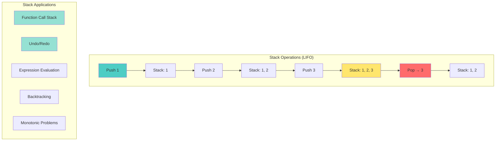
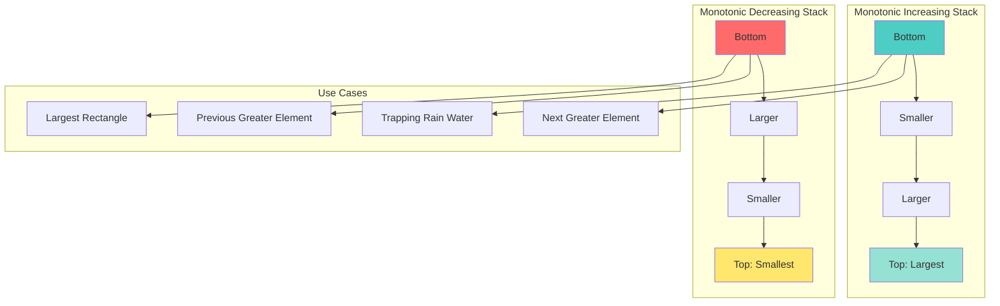
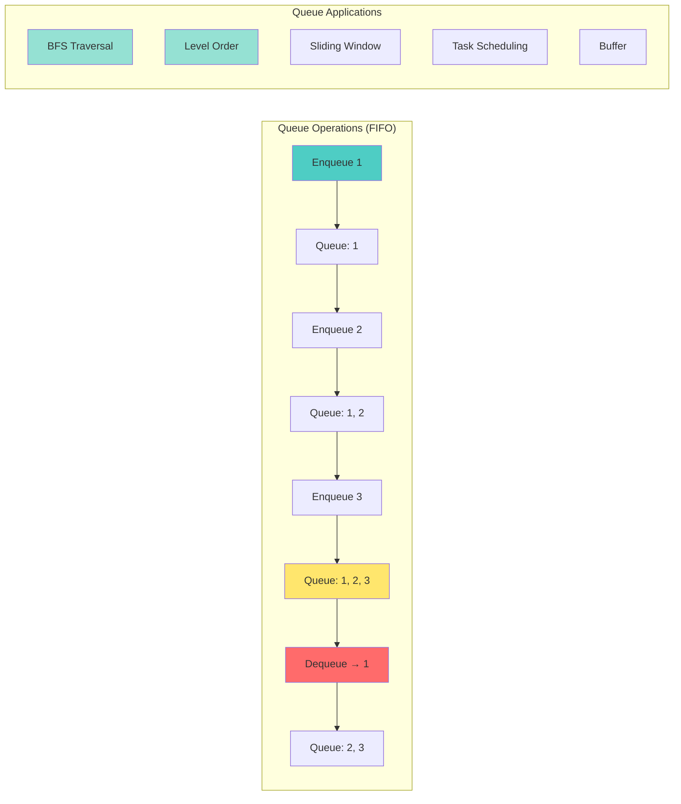

# 📘 **PROBLEM SOLVING MASTERY - Lesson 6: Stacks & Queues**

**Date**: 23-03-26
**Level**: 🟢 Beginner → 🔴 FAANG Ready
**Series**: DSA & Interview Preparation
**Time**: 90 minutes
**Prerequisites**: Lesson 1-5 (Fundamentals through Linked Lists)

---

## 🎯 **LEARNING OBJECTIVES**

After completing this **comprehensive** lesson, you will:

1. ✅ **Master Stack Fundamentals** - LIFO, implementations, applications
2. ✅ **Master Queue Fundamentals** - FIFO, circular queue, deque
3. ✅ **Master Monotonic Stack** - Next greater element, trapping rain water
4. ✅ **Master BFS Patterns** - Level order, shortest path, connected components
5. ✅ **Master DFS Patterns** - Tree traversal, path finding, backtracking
6. ✅ **Solve FAANG Problems** - Real interview questions with detailed solutions

---

## 📦 **PART 1: STACK FUNDAMENTALS**

### **Stack Structure & Operations**



---

### **Stack Implementation**

```javascript
// ─────────────────────────────────────────────
// STACK USING ARRAY
// ─────────────────────────────────────────────
class Stack {
  constructor() {
    this.items = [];
  }
  
  push(val) {
    this.items.push(val);
  }
  
  pop() {
    if (this.isEmpty()) return null;
    return this.items.pop();
  }
  
  peek() {
    if (this.isEmpty()) return null;
    return this.items[this.items.length - 1];
  }
  
  isEmpty() {
    return this.items.length === 0;
  }
  
  size() {
    return this.items.length;
  }
}

// ─────────────────────────────────────────────
// STACK USING LINKED LIST
// ─────────────────────────────────────────────
class StackNode {
  constructor(val) {
    this.val = val;
    this.next = null;
  }
}

class LinkedListStack {
  constructor() {
    this.top = null;
    this.size = 0;
  }
  
  push(val) {
    const node = new StackNode(val);
    node.next = this.top;
    this.top = node;
    this.size++;
  }
  
  pop() {
    if (!this.top) return null;
    const val = this.top.val;
    this.top = this.top.next;
    this.size--;
    return val;
  }
  
  peek() {
    return this.top ? this.top.val : null;
  }
  
  isEmpty() {
    return this.top === null;
  }
}

// Time Complexity for both:
// Push: O(1)
// Pop: O(1)
// Peek: O(1)
// Space: O(n)
```

---

### **Valid Parentheses**

```javascript
// ─────────────────────────────────────────────
// VALID PARENTHESES - LeetCode 20
// ─────────────────────────────────────────────
function isValid(s) {
  const stack = [];
  const pairs = {
    ')': '(',
    '}': '{',
    ']': '[',
  };
  
  for (const char of s) {
    if (char in pairs) {
      // Closing bracket
      const top = stack.pop() || '#';
      if (top !== pairs[char]) return false;
    } else {
      // Opening bracket
      stack.push(char);
    }
  }
  
  return stack.length === 0;
}

// Examples:
// "()[]{}" → true
// "([)]" → false
// "{[]}" → true

// Time: O(n), Space: O(n)

// ─────────────────────────────────────────────
// GENERATE PARENTHESES - LeetCode 22
// ─────────────────────────────────────────────
function generateParenthesis(n) {
  const result = [];
  
  function backtrack(current, open, close) {
    // Base case: valid combination complete
    if (current.length === n * 2) {
      result.push(current);
      return;
    }
    
    // Add opening bracket (if we have remaining)
    if (open < n) {
      backtrack(current + '(', open + 1, close);
    }
    
    // Add closing bracket (if valid)
    if (close < open) {
      backtrack(current + ')', open, close + 1);
    }
  }
  
  backtrack('', 0, 0);
  return result;
}

// Example: n = 3
// Output: ["((()))","(()())","(())()","()(())","()()()"]

// Time: O(4^n / √n) - Catalan number
// Space: O(n) for recursion
```

---

### **Expression Evaluation**

```javascript
// ─────────────────────────────────────────────
// MIN STACK - LeetCode 155
// ─────────────────────────────────────────────
class MinStack {
  constructor() {
    this.stack = [];
    this.minStack = [];  // Parallel stack for minimums
  }
  
  push(val) {
    this.stack.push(val);
    // Push to minStack if it's smaller or equal to current min
    if (this.minStack.length === 0 || val <= this.minStack[this.minStack.length - 1]) {
      this.minStack.push(val);
    }
  }
  
  pop() {
    const val = this.stack.pop();
    // Also pop from minStack if it's the current minimum
    if (val === this.minStack[this.minStack.length - 1]) {
      this.minStack.pop();
    }
    return val;
  }
  
  top() {
    return this.stack[this.stack.length - 1];
  }
  
  getMin() {
    return this.minStack[this.minStack.length - 1];
  }
}

// All operations: O(1) time, O(n) space

// ─────────────────────────────────────────────
// EVALUATE REVERSE POLISH NOTATION - LeetCode 150
// ─────────────────────────────────────────────
function evalRPN(tokens) {
  const stack = [];
  const operators = {
    '+': (a, b) => a + b,
    '-': (a, b) => a - b,
    '*': (a, b) => a * b,
    '/': (a, b) => Math.trunc(a / b),  // Truncate toward zero
  };
  
  for (const token of tokens) {
    if (token in operators) {
      const b = stack.pop();
      const a = stack.pop();
      stack.push(operators[token](a, b));
    } else {
      stack.push(parseInt(token));
    }
  }
  
  return stack[0];
}

// Example: ["2","1","+","3","*"]
// Stack: [2] → [2,1] → [3] → [3,3] → [9]
// Result: 9 ((2+1)*3)

// Time: O(n), Space: O(n)

// ─────────────────────────────────────────────
// BASIC CALCULATOR II - LeetCode 227
// ─────────────────────────────────────────────
function calculate(s) {
  const stack = [];
  let num = 0;
  let operator = '+';
  
  for (let i = 0; i < s.length; i++) {
    const char = s[i];
    
    // Build number
    if (char >= '0' && char <= '9') {
      num = num * 10 + parseInt(char);
    }
    
    // Process operator or end of string
    if ((char < '0' && char !== ' ') || i === s.length - 1) {
      switch (operator) {
        case '+':
          stack.push(num);
          break;
        case '-':
          stack.push(-num);
          break;
        case '*':
          stack.push(stack.pop() * num);
          break;
        case '/':
          stack.push(Math.trunc(stack.pop() / num));
          break;
      }
      operator = char;
      num = 0;
    }
  }
  
  return stack.reduce((sum, val) => sum + val, 0);
}

// Example: "3+2*2"
// Stack: [3] → [3, 2] → [3, 4] → Sum = 7

// Time: O(n), Space: O(n)
```

---

## 📦 **PART 2: MONOTONIC STACK**

### **Understanding Monotonic Stack**



---

### **Next Greater Element Pattern**

```javascript
// ─────────────────────────────────────────────
// NEXT GREATER ELEMENT I - LeetCode 496
// ─────────────────────────────────────────────
function nextGreaterElement(nums1, nums2) {
  const map = new Map();  // num → nextGreater
  const stack = [];  // Monotonic decreasing
  
  // Build map for all elements in nums2
  for (const num of nums2) {
    // While current num is greater than stack top
    while (stack.length > 0 && num > stack[stack.length - 1]) {
      const top = stack.pop();
      map.set(top, num);  // Found next greater for top
    }
    stack.push(num);
  }
  
  // Build result for nums1
  return nums1.map(num => map.get(num) || -1);
}

// Example: nums1 = [4,1,2], nums2 = [1,3,4,2]
// Map: {1→3, 3→4, 4→-1, 2→-1}
// Result: [-1, 3, -1]

// Time: O(m + n), Space: O(n)

// ─────────────────────────────────────────────
// NEXT GREATER ELEMENT II - Circular Array
// ─────────────────────────────────────────────
// LeetCode 503
function nextGreaterElements(nums) {
  const n = nums.length;
  const result = new Array(n).fill(-1);
  const stack = [];  // Store indices
  
  // Traverse array twice (circular)
  for (let i = 0; i < n * 2; i++) {
    const idx = i % n;
    
    while (stack.length > 0 && nums[idx] > nums[stack[stack.length - 1]]) {
      const top = stack.pop();
      result[top] = nums[idx];
    }
    
    stack.push(idx);
  }
  
  return result;
}

// Example: [1,2,1]
// Result: [2, -1, 2] (circular: after last 1 comes first 1, then 2)

// Time: O(n), Space: O(n)

// ─────────────────────────────────────────────
// DAILY TEMPERATURES - LeetCode 739
// ─────────────────────────────────────────────
function dailyTemperatures(temperatures) {
  const n = temperatures.length;
  const result = new Array(n).fill(0);
  const stack = [];  // Store indices
  
  for (let i = 0; i < n; i++) {
    // While current temp is greater than stack top
    while (stack.length > 0 && temperatures[i] > temperatures[stack[stack.length - 1]]) {
      const idx = stack.pop();
      result[idx] = i - idx;  // Days waited
    }
    stack.push(i);
  }
  
  return result;
}

// Example: [73,74,75,71,69,72,76,73]
// Result: [1,1,4,2,1,1,0,0]

// Time: O(n), Space: O(n)
```

---

### **Previous Greater Element**

```javascript
// ─────────────────────────────────────────────
// PREVIOUS GREATER ELEMENT
// ─────────────────────────────────────────────
function previousGreaterElement(nums) {
  const result = [];
  const stack = [];  // Monotonic decreasing
  
  for (const num of nums) {
    // Pop elements smaller than current
    while (stack.length > 0 && stack[stack.length - 1] < num) {
      stack.pop();
    }
    
    // Stack top is previous greater (or -1 if empty)
    result.push(stack.length === 0 ? -1 : stack[stack.length - 1]);
    stack.push(num);
  }
  
  return result;
}

// Example: [4, 5, 2, 25]
// Result: [-1, 4, -1, 2]

// ─────────────────────────────────────────────
// STOCK SPAN PROBLEM
// ─────────────────────────────────────────────
function calculateStockSpan(prices) {
  const span = [];
  const stack = [];  // Store [price, index]
  
  for (let i = 0; i < prices.length; i++) {
    // Pop all prices <= current price
    while (stack.length > 0 && stack[stack.length - 1][0] <= prices[i]) {
      stack.pop();
    }
    
    // Calculate span
    if (stack.length === 0) {
      span.push(i + 1);  // All previous days
    } else {
      span.push(i - stack[stack.length - 1][1]);  // Days since greater price
    }
    
    stack.push([prices[i], i]);
  }
  
  return span;
}

// Example: [100, 80, 60, 70, 60, 75, 85]
// Result: [1, 1, 1, 2, 1, 4, 5]
```

---

### **Advanced Monotonic Stack**

```javascript
// ─────────────────────────────────────────────
// TRAPPING RAIN WATER - LeetCode 42
// ─────────────────────────────────────────────
function trap(height) {
  let water = 0;
  const stack = [];  // Store indices (monotonic decreasing)
  
  for (let i = 0; i < height.length; i++) {
    // While current height > stack top height
    while (stack.length > 0 && height[i] > height[stack[stack.length - 1]]) {
      const bottom = stack.pop();
      
      if (stack.length === 0) break;  // No left boundary
      
      const left = stack[stack.length - 1];
      const width = i - left - 1;
      const boundedHeight = Math.min(height[left], height[i]) - height[bottom];
      
      water += width * boundedHeight;
    }
    
    stack.push(i);
  }
  
  return water;
}

// Visualization:
// Heights: [0,1,0,2,1,0,1,3,2,1,2,1]
//          ┌─┐
//      ┌───┤ │   ┌─┐
//      │   │ │┌──┤█├──┐
//  ┌───┤█│█│█│██│█│██│
//  └───┴─┴─┴─┴──┴─┴──┘
// Water: 6 units

// Time: O(n), Space: O(n)

// ─────────────────────────────────────────────
// LARGEST RECTANGLE IN HISTOGRAM - LeetCode 84
// ─────────────────────────────────────────────
function largestRectangleArea(heights) {
  let maxArea = 0;
  const stack = [];  // Store indices (monotonic increasing)
  
  for (let i = 0; i <= heights.length; i++) {
    // Use 0 as sentinel for remaining elements
    const h = i === heights.length ? 0 : heights[i];
    
    // While current height < stack top height
    while (stack.length > 0 && h < heights[stack[stack.length - 1]]) {
      const height = heights[stack.pop()];
      const width = stack.length === 0 ? i : i - stack[stack.length - 1] - 1;
      maxArea = Math.max(maxArea, height * width);
    }
    
    stack.push(i);
  }
  
  return maxArea;
}

// Example: [2,1,5,6,2,3]
// Largest rectangle: 5×2 = 10 (heights 5,6)

// Time: O(n), Space: O(n)

// ─────────────────────────────────────────────
// MAXIMAL RECTANGLE - LeetCode 85
// ─────────────────────────────────────────────
function maximalRectangle(matrix) {
  if (matrix.length === 0) return 0;
  
  const rows = matrix.length;
  const cols = matrix[0].length;
  const heights = new Array(cols + 1).fill(0);  // +1 for sentinel
  let maxArea = 0;
  
  for (const row of matrix) {
    // Update heights
    for (let i = 0; i < cols; i++) {
      heights[i] = row[i] === '1' ? heights[i] + 1 : 0;
    }
    
    // Calculate max area for current histogram
    const stack = [];
    for (let i = 0; i < heights.length; i++) {
      while (stack.length > 0 && heights[i] < heights[stack[stack.length - 1]]) {
        const h = heights[stack.pop()];
        const w = stack.length === 0 ? i : i - stack[stack.length - 1] - 1;
        maxArea = Math.max(maxArea, h * w);
      }
      stack.push(i);
    }
  }
  
  return maxArea;
}

// Time: O(m × n), Space: O(n)
```

---

## 📦 **PART 3: QUEUE FUNDAMENTALS**

### **Queue Structure & Operations**



---

### **Queue Implementation**

```javascript
// ─────────────────────────────────────────────
// QUEUE USING ARRAY (Inefficient for dequeue)
// ─────────────────────────────────────────────
class ArrayQueue {
  constructor() {
    this.items = [];
  }
  
  enqueue(val) {
    this.items.push(val);  // O(1)
  }
  
  dequeue() {
    return this.items.shift();  // O(n) - shifts all elements
  }
  
  front() {
    return this.items[0];
  }
  
  isEmpty() {
    return this.items.length === 0;
  }
}

// ─────────────────────────────────────────────
// QUEUE USING LINKED LIST (Efficient)
// ─────────────────────────────────────────────
class QueueNode {
  constructor(val) {
    this.val = val;
    this.next = null;
  }
}

class LinkedListQueue {
  constructor() {
    this.front = null;
    this.rear = null;
    this.size = 0;
  }
  
  enqueue(val) {
    const node = new QueueNode(val);
    if (this.isEmpty()) {
      this.front = node;
    } else {
      this.rear.next = node;
    }
    this.rear = node;
    this.size++;
  }
  
  dequeue() {
    if (this.isEmpty()) return null;
    const val = this.front.val;
    this.front = this.front.next;
    if (this.front === null) {
      this.rear = null;
    }
    this.size--;
    return val;
  }
  
  front() {
    return this.front ? this.front.val : null;
  }
  
  isEmpty() {
    return this.front === null;
  }
}

// All operations: O(1)
// Space: O(n)

// ─────────────────────────────────────────────
// CIRCULAR QUEUE (Array-based, Efficient)
// ─────────────────────────────────────────────
class CircularQueue {
  constructor(k) {
    this.capacity = k;
    this.queue = new Array(k);
    this.front = 0;
    this.rear = 0;
    this.size = 0;
  }
  
  enqueue(val) {
    if (this.isFull()) return false;
    this.queue[this.rear] = val;
    this.rear = (this.rear + 1) % this.capacity;
    this.size++;
    return true;
  }
  
  dequeue() {
    if (this.isEmpty()) return null;
    const val = this.queue[this.front];
    this.front = (this.front + 1) % this.capacity;
    this.size--;
    return val;
  }
  
  front() {
    return this.isEmpty() ? -1 : this.queue[this.front];
  }
  
  rear() {
    return this.isEmpty() ? -1 : this.queue[(this.rear - 1 + this.capacity) % this.capacity];
  }
  
  isEmpty() {
    return this.size === 0;
  }
  
  isFull() {
    return this.size === this.capacity;
  }
}

// All operations: O(1)
// Space: O(k)
```

---

### **Deque (Double-Ended Queue)**

```javascript
// ─────────────────────────────────────────────
// DEQUE IMPLEMENTATION
// ─────────────────────────────────────────────
class Deque {
  constructor() {
    this.items = [];
  }
  
  addFront(val) {
    this.items.unshift(val);
  }
  
  addRear(val) {
    this.items.push(val);
  }
  
  removeFront() {
    return this.items.shift();
  }
  
  removeRear() {
    return this.items.pop();
  }
  
  front() {
    return this.items[0];
  }
  
  rear() {
    return this.items[this.items.length - 1];
  }
  
  isEmpty() {
    return this.items.length === 0;
  }
  
  size() {
    return this.items.length;
  }
}

// ─────────────────────────────────────────────
// SLIDING WINDOW MAXIMUM - LeetCode 239
// ─────────────────────────────────────────────
function maxSlidingWindow(nums, k) {
  const result = [];
  const deque = [];  // Store indices (monotonic decreasing)
  
  for (let i = 0; i < nums.length; i++) {
    // Remove indices outside window
    while (deque.length > 0 && deque[0] <= i - k) {
      deque.shift();
    }
    
    // Maintain monotonic decreasing
    while (deque.length > 0 && nums[i] > nums[deque[deque.length - 1]]) {
      deque.pop();
    }
    
    deque.push(i);
    
    // Add maximum for current window
    if (i >= k - 1) {
      result.push(nums[deque[0]]);
    }
  }
  
  return result;
}

// Example: nums = [1,3,-1,-3,5,3,6,7], k = 3
// Result: [3,3,5,5,6,7]

// Time: O(n), Space: O(k)
```

---

## 📦 **PART 4: BFS PATTERNS**

### **BFS Template**

```javascript
// ─────────────────────────────────────────────
// BFS TEMPLATE FOR GRAPHS
// ─────────────────────────────────────────────
function bfs(graph, start) {
  const queue = [start];
  const visited = new Set([start]);
  const result = [];
  
  while (queue.length > 0) {
    const node = queue.shift();
    result.push(node);
    
    for (const neighbor of graph[node]) {
      if (!visited.has(neighbor)) {
        visited.add(neighbor);
        queue.push(neighbor);
      }
    }
  }
  
  return result;
}

// ─────────────────────────────────────────────
// BFS TEMPLATE FOR TREES (Level Order)
// ─────────────────────────────────────────────
function levelOrder(root) {
  if (!root) return [];
  
  const result = [];
  const queue = [root];
  
  while (queue.length > 0) {
    const levelSize = queue.length;
    const currentLevel = [];
    
    for (let i = 0; i < levelSize; i++) {
      const node = queue.shift();
      currentLevel.push(node.val);
      
      if (node.left) queue.push(node.left);
      if (node.right) queue.push(node.right);
    }
    
    result.push(currentLevel);
  }
  
  return result;
}

// ─────────────────────────────────────────────
// BFS FOR SHORTEST PATH
// ─────────────────────────────────────────────
function shortestPath(grid, start, end) {
  const rows = grid.length;
  const cols = grid[0].length;
  const queue = [[start, 0]];  // [position, distance]
  const visited = new Set([start.toString()]);
  
  const directions = [[0, 1], [0, -1], [1, 0], [-1, 0]];
  
  while (queue.length > 0) {
    const [[r, c], dist] = queue.shift();
    
    if (r === end[0] && c === end[1]) {
      return dist;
    }
    
    for (const [dr, dc] of directions) {
      const nr = r + dr;
      const nc = c + dc;
      const key = `${nr},${nc}`;
      
      if (nr >= 0 && nr < rows && nc >= 0 && nc < cols &&
          grid[nr][nc] !== 1 && !visited.has(key)) {
        visited.add(key);
        queue.push([[nr, nc], dist + 1]);
      }
    }
  }
  
  return -1;  // No path found
}
```

---

### **BFS Problems**

```javascript
// ─────────────────────────────────────────────
// BINARY TREE LEVEL ORDER TRAVERSAL - LeetCode 102
// ─────────────────────────────────────────────
function levelOrderTraversal(root) {
  if (!root) return [];
  
  const result = [];
  const queue = [root];
  
  while (queue.length > 0) {
    const levelSize = queue.length;
    const currentLevel = [];
    
    for (let i = 0; i < levelSize; i++) {
      const node = queue.shift();
      currentLevel.push(node.val);
      
      if (node.left) queue.push(node.left);
      if (node.right) queue.push(node.right);
    }
    
    result.push(currentLevel);
  }
  
  return result;
}

// Time: O(n), Space: O(n)

// ─────────────────────────────────────────────
// BINARY TREE ZIGZAG LEVEL ORDER - LeetCode 103
// ─────────────────────────────────────────────
function zigzagLevelOrder(root) {
  if (!root) return [];
  
  const result = [];
  const queue = [root];
  let leftToRight = true;
  
  while (queue.length > 0) {
    const levelSize = queue.length;
    const currentLevel = [];
    
    for (let i = 0; i < levelSize; i++) {
      const node = queue.shift();
      
      if (leftToRight) {
        currentLevel.push(node.val);
      } else {
        currentLevel.unshift(node.val);
      }
      
      if (node.left) queue.push(node.left);
      if (node.right) queue.push(node.right);
    }
    
    result.push(currentLevel);
    leftToRight = !leftToRight;
  }
  
  return result;
}

// ─────────────────────────────────────────────
// ROTTTEN ORANGES - LeetCode 994
// ─────────────────────────────────────────────
function orangesRotting(grid) {
  const rows = grid.length;
  const cols = grid[0].length;
  const queue = [];
  let freshCount = 0;
  
  // Initialize: add all rotten oranges to queue
  for (let r = 0; r < rows; r++) {
    for (let c = 0; c < cols; c++) {
      if (grid[r][c] === 2) {
        queue.push([r, c, 0]);  // [row, col, time]
      } else if (grid[r][c] === 1) {
        freshCount++;
      }
    }
  }
  
  if (freshCount === 0) return 0;  // No fresh oranges
  
  const directions = [[0, 1], [0, -1], [1, 0], [-1, 0]];
  let maxTime = 0;
  
  while (queue.length > 0) {
    const [r, c, time] = queue.shift();
    maxTime = Math.max(maxTime, time);
    
    for (const [dr, dc] of directions) {
      const nr = r + dr;
      const nc = c + dc;
      
      if (nr >= 0 && nr < rows && nc >= 0 && nc < cols && grid[nr][nc] === 1) {
        grid[nr][nc] = 2;  // Make rotten
        freshCount--;
        queue.push([nr, nc, time + 1]);
      }
    }
  }
  
  return freshCount === 0 ? maxTime : -1;
}

// Time: O(m × n), Space: O(m × n)
```

---

## 📦 **PART 5: DFS PATTERNS**

### **DFS Templates**

```javascript
// ─────────────────────────────────────────────
// DFS TEMPLATE (Recursive)
// ─────────────────────────────────────────────
function dfsRecursive(node, visited, graph) {
  if (!node || visited.has(node)) return;
  
  visited.add(node);
  console.log(node);  // Process node
  
  for (const neighbor of graph[node]) {
    dfsRecursive(neighbor, visited, graph);
  }
}

// ─────────────────────────────────────────────
// DFS TEMPLATE (Iterative with Stack)
// ─────────────────────────────────────────────
function dfsIterative(start, graph) {
  const stack = [start];
  const visited = new Set([start]);
  const result = [];
  
  while (stack.length > 0) {
    const node = stack.pop();
    result.push(node);
    
    for (const neighbor of graph[node]) {
      if (!visited.has(neighbor)) {
        visited.add(neighbor);
        stack.push(neighbor);
      }
    }
  }
  
  return result;
}

// ─────────────────────────────────────────────
// DFS FOR PATH FINDING
// ─────────────────────────────────────────────
function dfsPath(graph, start, end, path = [], visited = new Set()) {
  path.push(start);
  visited.add(start);
  
  if (start === end) {
    return [...path];  // Found path
  }
  
  for (const neighbor of graph[start]) {
    if (!visited.has(neighbor)) {
      const result = dfsPath(graph, neighbor, end, path, visited);
      if (result) return result;
    }
  }
  
  // Backtrack
  path.pop();
  visited.delete(start);
  return null;
}
```

---

### **DFS Problems**

```javascript
// ─────────────────────────────────────────────
// NUMBER OF ISLANDS - LeetCode 200
// ─────────────────────────────────────────────
function numIslands(grid) {
  if (!grid || grid.length === 0) return 0;
  
  const rows = grid.length;
  const cols = grid[0].length;
  let count = 0;
  
  function dfs(r, c) {
    // Base cases: out of bounds or water
    if (r < 0 || r >= rows || c < 0 || c >= cols || grid[r][c] === '0') {
      return;
    }
    
    // Mark as visited (turn to water)
    grid[r][c] = '0';
    
    // Explore all 4 directions
    dfs(r + 1, c);
    dfs(r - 1, c);
    dfs(r, c + 1);
    dfs(r, c - 1);
  }
  
  for (let r = 0; r < rows; r++) {
    for (let c = 0; c < cols; c++) {
      if (grid[r][c] === '1') {
        count++;
        dfs(r, c);
      }
    }
  }
  
  return count;
}

// Time: O(m × n), Space: O(m × n) for recursion

// ─────────────────────────────────────────────
// MAXIMUM AREA OF ISLAND - LeetCode 695
// ─────────────────────────────────────────────
function maxAreaOfIsland(grid) {
  const rows = grid.length;
  const cols = grid[0].length;
  let maxArea = 0;
  
  function dfs(r, c) {
    if (r < 0 || r >= rows || c < 0 || c >= cols || grid[r][c] === 0) {
      return 0;
    }
    
    grid[r][c] = 0;  // Mark as visited
    
    return 1 + dfs(r + 1, c) + dfs(r - 1, c) + dfs(r, c + 1) + dfs(r, c - 1);
  }
  
  for (let r = 0; r < rows; r++) {
    for (let c = 0; c < cols; c++) {
      if (grid[r][c] === 1) {
        maxArea = Math.max(maxArea, dfs(r, c));
      }
    }
  }
  
  return maxArea;
}

// ─────────────────────────────────────────────
// SURROUNDED REGIONS - LeetCode 130
// ─────────────────────────────────────────────
function solve(board) {
  if (!board || board.length === 0) return;
  
  const rows = board.length;
  const cols = board[0].length;
  
  // DFS to mark 'O's connected to border
  function dfs(r, c) {
    if (r < 0 || r >= rows || c < 0 || c >= cols || board[r][c] !== 'O') {
      return;
    }
    
    board[r][c] = 'T';  // Temporary mark
    
    dfs(r + 1, c);
    dfs(r - 1, c);
    dfs(r, c + 1);
    dfs(r, c - 1);
  }
  
  // Mark all 'O's connected to borders
  for (let r = 0; r < rows; r++) {
    dfs(r, 0);
    dfs(r, cols - 1);
  }
  for (let c = 0; c < cols; c++) {
    dfs(0, c);
    dfs(rows - 1, c);
  }
  
  // Flip remaining 'O's to 'X's and restore 'T's to 'O's
  for (let r = 0; r < rows; r++) {
    for (let c = 0; c < cols; c++) {
      if (board[r][c] === 'O') {
        board[r][c] = 'X';
      } else if (board[r][c] === 'T') {
        board[r][c] = 'O';
      }
    }
  }
}

// Time: O(m × n), Space: O(m × n)
```

---

## ✅ **STACKS & QUEUES CHECKLIST**

```
Stack Fundamentals
[ ] Stack implementation (array & linked list)
[ ] Valid parentheses
[ ] Min stack
[ ] Expression evaluation

Monotonic Stack
[ ] Next greater element
[ ] Previous greater element
[ ] Daily temperatures
[ ] Trapping rain water
[ ] Largest rectangle in histogram

Queue Fundamentals
[ ] Queue implementation
[ ] Circular queue
[ ] Deque operations
[ ] Sliding window maximum

BFS Patterns
[ ] Level order traversal
[ ] Shortest path in grid
[ ] Connected components

DFS Patterns
[ ] Recursive DFS
[ ] Iterative DFS
[ ] Number of islands
[ ] Path finding
```

---

## 🎯 **KNOWLEDGE CHECK**

### **Question 1: Monotonic Stack**

When should you use a monotonic stack?

<details>
<summary>💡 Click to reveal answer</summary>

**Use monotonic stack when:**
- Finding next/previous greater/smaller element
- Finding the range where an element is maximum/minimum
- Problems involving "first element that satisfies condition"
- Trapping rain water, largest rectangle problems

**Pattern:**
```javascript
const stack = [];
for (const num of nums) {
  while (stack.length && num > stack[stack.length - 1]) {
    stack.pop();  // Maintain monotonic property
  }
  stack.push(num);
}
```
</details>

---

### **Question 2: BFS vs DFS**

When should you use BFS vs DFS?

<details>
<summary>💡 Click to reveal answer</summary>

**Use BFS when:**
- Finding shortest path in unweighted graph
- Level-order traversal
- Finding minimum distance/steps

**Use DFS when:**
- Finding any path (not necessarily shortest)
- Exploring all possibilities
- Backtracking problems
- Topological sort
- Connected components

**Memory consideration:**
- BFS: O(w) where w = maximum width
- DFS: O(h) where h = maximum height
</details>

---

## 📚 **PRACTICE PROBLEMS**

### **Easy**
- Valid Parentheses (LeetCode 20)
- Min Stack (LeetCode 155)
- Implement Queue using Stacks (LeetCode 232)
- Binary Tree Level Order Traversal (LeetCode 102)

### **Medium**
- Next Greater Element I (LeetCode 496)
- Daily Temperatures (LeetCode 739)
- Sliding Window Maximum (LeetCode 239)
- Number of Islands (LeetCode 200)
- Rotting Oranges (LeetCode 994)

### **Hard**
- Trapping Rain Water (LeetCode 42)
- Largest Rectangle in Histogram (LeetCode 84)
- Maximal Rectangle (LeetCode 85)
- Binary Tree Maximum Path Sum (LeetCode 124)

---

## 🎓 **HOMEWORK**

1. ✅ Solve 10 stack/queue problems
2. ✅ Implement monotonic stack for 5 different problems
3. ✅ Solve BFS and DFS versions of same problem
4. ✅ Create visual diagrams for 3 problems
5. ✅ Time yourself: 3 medium problems in 45 minutes

---

**Next Lesson**: Trees & Graphs - Traversals, BST, Union Find
**Date**: 23-03-26
**Status**: ✅ Complete

---
-23-03-26
