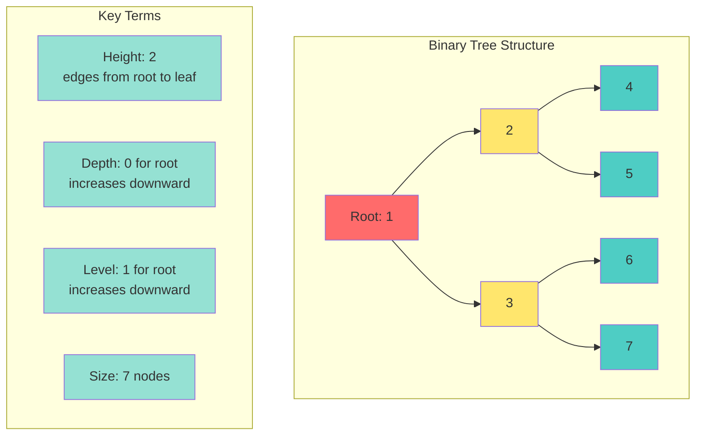
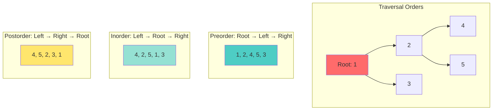

# 📘 **PROBLEM SOLVING MASTERY - Lesson 7: Trees & Graphs**

**Date**: 23-03-26
**Level**: 🟢 Beginner → 🔴 FAANG Ready
**Series**: DSA & Interview Preparation
**Time**: 120 minutes
**Prerequisites**: Lesson 1-6 (Fundamentals through Stacks & Queues)

---

## 🎯 **LEARNING OBJECTIVES**

After completing this **comprehensive** lesson, you will:

1. ✅ **Master Binary Tree Traversals** - Preorder, inorder, postorder, level order
2. ✅ **Master BST Operations** - Search, insert, delete, validation
3. ✅ **Master Tree DFS Patterns** - Path sum, diameter, LCA, serialization
4. ✅ **Master Graph Representations** - Adjacency list/matrix, edge list
5. ✅ **Master Graph Algorithms** - BFS, DFS, topological sort, Union Find
6. ✅ **Solve FAANG Problems** - Real interview questions with detailed solutions

---

## 📦 **PART 1: TREE FUNDAMENTALS**

### **Tree Structure & Terminology**



---

### **Tree Node Definition**

```javascript
// ─────────────────────────────────────────────
// BINARY TREE NODE
// ─────────────────────────────────────────────
class TreeNode {
  constructor(val = 0, left = null, right = null) {
    this.val = val;
    this.left = left;
    this.right = right;
  }
}

// ─────────────────────────────────────────────
// CREATE TREE FROM ARRAY (Level Order)
// ─────────────────────────────────────────────
function createTree(arr) {
  if (arr.length === 0 || arr[0] === null) return null;
  
  const root = new TreeNode(arr[0]);
  const queue = [root];
  let i = 1;
  
  while (queue.length > 0 && i < arr.length) {
    const node = queue.shift();
    
    // Left child
    if (i < arr.length && arr[i] !== null) {
      node.left = new TreeNode(arr[i]);
      queue.push(node.left);
    }
    i++;
    
    // Right child
    if (i < arr.length && arr[i] !== null) {
      node.right = new TreeNode(arr[i]);
      queue.push(node.right);
    }
    i++;
  }
  
  return root;
}

// Usage: [1,2,3,4,5,6,7]
//       1
//      / \
//     2   3
//    / \ / \
//   4  5 6  7

// ─────────────────────────────────────────────
// TREE TO ARRAY (Level Order)
// ─────────────────────────────────────────────
function treeToArray(root) {
  if (!root) return [];
  
  const result = [];
  const queue = [root];
  
  while (queue.length > 0) {
    const node = queue.shift();
    
    if (node) {
      result.push(node.val);
      queue.push(node.left);
      queue.push(node.right);
    } else {
      result.push(null);
    }
  }
  
  // Remove trailing nulls
  while (result[result.length - 1] === null) {
    result.pop();
  }
  
  return result;
}
```

---

## 📦 **PART 2: TREE TRAVERSALS**

### **DFS Traversals (Recursive)**



---

```javascript
// ─────────────────────────────────────────────
// PREORDER TRAVERSAL (Root → Left → Right)
// ─────────────────────────────────────────────
// LeetCode 144
function preorderTraversal(root) {
  const result = [];
  
  function dfs(node) {
    if (!node) return;
    
    result.push(node.val);      // Root
    dfs(node.left);             // Left
    dfs(node.right);            // Right
  }
  
  dfs(root);
  return result;
}

// Iterative version using stack
function preorderIterative(root) {
  if (!root) return [];
  
  const result = [];
  const stack = [root];
  
  while (stack.length > 0) {
    const node = stack.pop();
    result.push(node.val);
    
    // Push right first (so left is processed first)
    if (node.right) stack.push(node.right);
    if (node.left) stack.push(node.left);
  }
  
  return result;
}

// ─────────────────────────────────────────────
// INORDER TRAVERSAL (Left → Root → Right)
// ─────────────────────────────────────────────
// LeetCode 94
function inorderTraversal(root) {
  const result = [];
  
  function dfs(node) {
    if (!node) return;
    
    dfs(node.left);             // Left
    result.push(node.val);      // Root
    dfs(node.right);            // Right
  }
  
  dfs(root);
  return result;
}

// Iterative version using stack
function inorderIterative(root) {
  const result = [];
  const stack = [];
  let current = root;
  
  while (current || stack.length > 0) {
    // Go to leftmost node
    while (current) {
      stack.push(current);
      current = current.left;
    }
    
    // Process node
    current = stack.pop();
    result.push(current.val);
    
    // Go to right
    current = current.right;
  }
  
  return result;
}

// ─────────────────────────────────────────────
// POSTORDER TRAVERSAL (Left → Right → Root)
// ─────────────────────────────────────────────
// LeetCode 145
function postorderTraversal(root) {
  const result = [];
  
  function dfs(node) {
    if (!node) return;
    
    dfs(node.left);             // Left
    dfs(node.right);            // Right
    result.push(node.val);      // Root
  }
  
  dfs(root);
  return result;
}

// Iterative version (two stacks)
function postorderIterative(root) {
  if (!root) return [];
  
  const result = [];
  const stack1 = [root];
  const stack2 = [];
  
  while (stack1.length > 0) {
    const node = stack1.pop();
    stack2.push(node);
    
    if (node.left) stack1.push(node.left);
    if (node.right) stack1.push(node.right);
  }
  
  while (stack2.length > 0) {
    result.push(stack2.pop().val);
  }
  
  return result;
}

// ─────────────────────────────────────────────
// LEVEL ORDER TRAVERSAL (BFS)
// ─────────────────────────────────────────────
// LeetCode 102
function levelOrder(root) {
  if (!root) return [];
  
  const result = [];
  const queue = [root];
  
  while (queue.length > 0) {
    const levelSize = queue.length;
    const currentLevel = [];
    
    for (let i = 0; i < levelSize; i++) {
      const node = queue.shift();
      currentLevel.push(node.val);
      
      if (node.left) queue.push(node.left);
      if (node.right) queue.push(node.right);
    }
    
    result.push(currentLevel);
  }
  
  return result;
}

// Time: O(n), Space: O(n)
```

---

## 📦 **PART 3: BINARY SEARCH TREE (BST)**

### **BST Properties & Operations**

```mermaid
graph TB
    subgraph "BST Property"
        A[Root: 8]
        B[3]
        C[10]
        D[1]
        E[6]
        F[14]
        G[4]
        H[7]
        I[13]
        
        A --> B
        A --> C
        B --> D
        B --> E
        C --> F
        E --> G
        E --> H
        F --> I
        
        style A fill:#ff6b6b
        style B fill:#ffe66d
        style C fill:#ffe66d
    end
    
    note: "Left subtree < Root < Right subtree"
```

---

```javascript
// ─────────────────────────────────────────────
// BST NODE
// ─────────────────────────────────────────────
class BSTNode {
  constructor(val = 0, left = null, right = null) {
    this.val = val;
    this.left = left;
    this.right = right;
  }
}

// ─────────────────────────────────────────────
// SEARCH IN BST
// ─────────────────────────────────────────────
// LeetCode 700
function searchBST(root, val) {
  if (!root) return null;
  
  if (root.val === val) {
    return root;
  } else if (val < root.val) {
    return searchBST(root.left, val);
  } else {
    return searchBST(root.right, val);
  }
}

// Iterative version
function searchBSTIterative(root, val) {
  let current = root;
  
  while (current) {
    if (current.val === val) {
      return current;
    } else if (val < current.val) {
      current = current.left;
    } else {
      current = current.right;
    }
  }
  
  return null;
}

// Time: O(h) where h = height
// Best/Average: O(log n), Worst: O(n)

// ─────────────────────────────────────────────
// INSERT INTO BST
// ─────────────────────────────────────────────
// LeetCode 701
function insertIntoBST(root, val) {
  if (!root) {
    return new BSTNode(val);
  }
  
  if (val < root.val) {
    root.left = insertIntoBST(root.left, val);
  } else {
    root.right = insertIntoBST(root.right, val);
  }
  
  return root;
}

// ─────────────────────────────────────────────
// DELETE FROM BST
// ─────────────────────────────────────────────
// LeetCode 450
function deleteNode(root, key) {
  if (!root) return null;
  
  if (key < root.val) {
    root.left = deleteNode(root.left, key);
  } else if (key > root.val) {
    root.right = deleteNode(root.right, key);
  } else {
    // Found node to delete
    
    // Case 1: No child or one child
    if (!root.left) return root.right;
    if (!root.right) return root.left;
    
    // Case 2: Two children
    // Find inorder successor (smallest in right subtree)
    let successor = root.right;
    while (successor.left) {
      successor = successor.left;
    }
    
    // Replace with successor's value
    root.val = successor.val;
    
    // Delete successor
    root.right = deleteNode(root.right, successor.val);
  }
  
  return root;
}

// ─────────────────────────────────────────────
// VALIDATE BST
// ─────────────────────────────────────────────
// LeetCode 98
function isValidBST(root) {
  function validate(node, min, max) {
    if (!node) return true;
    
    // Check bounds
    if (node.val <= min || node.val >= max) {
      return false;
    }
    
    // Recursively validate subtrees
    return validate(node.left, min, node.val) &&
           validate(node.right, node.val, max);
  }
  
  return validate(root, -Infinity, Infinity);
}

// Inorder traversal approach
function isValidBSTInorder(root) {
  let prev = -Infinity;
  
  function inorder(node) {
    if (!node) return true;
    
    if (!inorder(node.left)) return false;
    
    if (node.val <= prev) return false;
    prev = node.val;
    
    return inorder(node.right);
  }
  
  return inorder(root);
}

// Time: O(n), Space: O(h)
```

---

## 📦 **PART 4: TREE DFS PATTERNS**

### **Path Sum Problems**

```javascript
// ─────────────────────────────────────────────
// PATH SUM - LeetCode 112
// ─────────────────────────────────────────────
function hasPathSum(root, targetSum) {
  if (!root) return false;
  
  // Leaf node check
  if (!root.left && !root.right) {
    return root.val === targetSum;
  }
  
  const remaining = targetSum - root.val;
  return hasPathSum(root.left, remaining) ||
         hasPathSum(root.right, remaining);
}

// ─────────────────────────────────────────────
// PATH SUM II - All Paths - LeetCode 113
// ─────────────────────────────────────────────
function pathSum(root, targetSum) {
  const result = [];
  
  function dfs(node, path, remaining) {
    if (!node) return;
    
    path.push(node.val);
    
    // Leaf node check
    if (!node.left && !node.right && node.val === remaining) {
      result.push([...path]);
    }
    
    dfs(node.left, path, remaining - node.val);
    dfs(node.right, path, remaining - node.val);
    
    path.pop();  // Backtrack
  }
  
  dfs(root, [], targetSum);
  return result;
}

// ─────────────────────────────────────────────
// PATH SUM III - Any Direction - LeetCode 437
// ─────────────────────────────────────────────
function pathSumIII(root, targetSum) {
  let count = 0;
  
  // Count paths starting from this node
  function dfsFromNode(node, sum) {
    if (!node) return;
    
    if (node.val === sum) count++;
    
    dfsFromNode(node.left, sum - node.val);
    dfsFromNode(node.right, sum - node.val);
  }
  
  // Try starting from each node
  function dfs(node) {
    if (!node) return;
    
    dfsFromNode(node, targetSum);
    dfs(node.left);
    dfs(node.right);
  }
  
  dfs(root);
  return count;
}

// Optimized with prefix sum
function pathSumIIIOptimized(root, targetSum) {
  const prefixSum = new Map();
  prefixSum.set(0, 1);  // Base case
  let count = 0;
  
  function dfs(node, currentSum) {
    if (!node) return;
    
    currentSum += node.val;
    
    // Check if there's a subpath ending here
    const needed = currentSum - targetSum;
    if (prefixSum.has(needed)) {
      count += prefixSum.get(needed);
    }
    
    // Add current sum to prefix sums
    prefixSum.set(currentSum, (prefixSum.get(currentSum) || 0) + 1);
    
    dfs(node.left, currentSum);
    dfs(node.right, currentSum);
    
    // Backtrack
    prefixSum.set(currentSum, prefixSum.get(currentSum) - 1);
  }
  
  dfs(root, 0);
  return count;
}
```

---

### **Diameter & Depth**

```javascript
// ─────────────────────────────────────────────
// MAXIMUM DEPTH - LeetCode 104
// ─────────────────────────────────────────────
function maxDepth(root) {
  if (!root) return 0;
  
  return 1 + Math.max(maxDepth(root.left), maxDepth(root.right));
}

// Iterative BFS
function maxDepthBFS(root) {
  if (!root) return 0;
  
  const queue = [root];
  let depth = 0;
  
  while (queue.length > 0) {
    const levelSize = queue.length;
    
    for (let i = 0; i < levelSize; i++) {
      const node = queue.shift();
      
      if (node.left) queue.push(node.left);
      if (node.right) queue.push(node.right);
    }
    
    depth++;
  }
  
  return depth;
}

// ─────────────────────────────────────────────
// DIAMETER OF BINARY TREE - LeetCode 543
// ─────────────────────────────────────────────
function diameterOfBinaryTree(root) {
  let maxDiameter = 0;
  
  function height(node) {
    if (!node) return 0;
    
    const leftHeight = height(node.left);
    const rightHeight = height(node.right);
    
    // Diameter through this node
    maxDiameter = Math.max(maxDiameter, leftHeight + rightHeight);
    
    // Return height
    return 1 + Math.max(leftHeight, rightHeight);
  }
  
  height(root);
  return maxDiameter;
}

// ─────────────────────────────────────────────
// BALANCED BINARY TREE - LeetCode 110
// ─────────────────────────────────────────────
function isBalanced(root) {
  let balanced = true;
  
  function height(node) {
    if (!node || !balanced) return 0;
    
    const leftHeight = height(node.left);
    const rightHeight = height(node.right);
    
    if (Math.abs(leftHeight - rightHeight) > 1) {
      balanced = false;
    }
    
    return 1 + Math.max(leftHeight, rightHeight);
  }
  
  height(root);
  return balanced;
}
```

---

### **Lowest Common Ancestor**

```javascript
// ─────────────────────────────────────────────
// LCA - BINARY TREE - LeetCode 236
// ─────────────────────────────────────────────
function lowestCommonAncestor(root, p, q) {
  if (!root || root === p || root === q) {
    return root;
  }
  
  const left = lowestCommonAncestor(root.left, p, q);
  const right = lowestCommonAncestor(root.right, p, q);
  
  if (left && right) {
    return root;  // p and q found in different subtrees
  }
  
  return left || right;  // Return non-null child
}

// ─────────────────────────────────────────────
// LCA - BST - LeetCode 235
// ─────────────────────────────────────────────
function lowestCommonAncestorBST(root, p, q) {
  let current = root;
  
  while (current) {
    // Both in right subtree
    if (p.val > current.val && q.val > current.val) {
      current = current.right;
    }
    // Both in left subtree
    else if (p.val < current.val && q.val < current.val) {
      current = current.left;
    }
    // Split point found
    else {
      return current;
    }
  }
  
  return null;
}
```

---

## 📦 **PART 5: GRAPH FUNDAMENTALS**

### **Graph Representations**

```mermaid
graph TB
    subgraph "Adjacency List"
        A[0: [1, 2]]
        B[1: [0, 3]]
        C[2: [0, 3]]
        D[3: [1, 2]]
        
        style A fill:#4ecdc4
        style B fill:#95e1d3
        style C fill:#95e1d3
        style D fill:#95e1d3
    end
    
    subgraph "Graph Visualization"
        E[0]
        F[1]
        G[2]
        H[3]
        
        E --- F
        E --- G
        F --- H
        G --- H
        
        style E fill:#ff6b6b
        style F fill:#ffe66d
        style G fill:#ffe66d
        style H fill:#ffe66d
    end
```

---

```javascript
// ─────────────────────────────────────────────
// GRAPH REPRESENTATIONS
// ─────────────────────────────────────────────
// Adjacency List (most common)
const adjList = {
  0: [1, 2],
  1: [0, 3],
  2: [0, 3],
  3: [1, 2],
};

// Adjacency Matrix
const adjMatrix = [
  [0, 1, 1, 0],
  [1, 0, 0, 1],
  [1, 0, 0, 1],
  [0, 1, 1, 0],
];

// Edge List
const edgeList = [
  [0, 1],
  [0, 2],
  [1, 3],
  [2, 3],
];

// ─────────────────────────────────────────────
// BUILD ADJACENCY LIST FROM EDGES
// ─────────────────────────────────────────────
function buildGraph(edges, directed = false) {
  const graph = {};
  
  for (const [u, v] of edges) {
    if (!graph[u]) graph[u] = [];
    if (!graph[v]) graph[v] = [];
    
    graph[u].push(v);
    if (!directed) {
      graph[v].push(u);
    }
  }
  
  return graph;
}
```

---

### **Graph Traversals**

```javascript
// ─────────────────────────────────────────────
// BFS FOR GRAPH
// ─────────────────────────────────────────────
function bfsGraph(graph, start) {
  const queue = [start];
  const visited = new Set([start]);
  const result = [];
  
  while (queue.length > 0) {
    const node = queue.shift();
    result.push(node);
    
    for (const neighbor of graph[node]) {
      if (!visited.has(neighbor)) {
        visited.add(neighbor);
        queue.push(neighbor);
      }
    }
  }
  
  return result;
}

// ─────────────────────────────────────────────
// DFS FOR GRAPH (Recursive)
// ─────────────────────────────────────────────
function dfsGraphRecursive(graph, start, visited = new Set()) {
  visited.add(start);
  console.log(start);
  
  for (const neighbor of graph[start]) {
    if (!visited.has(neighbor)) {
      dfsGraphRecursive(graph, neighbor, visited);
    }
  }
}

// ─────────────────────────────────────────────
// DFS FOR GRAPH (Iterative)
// ─────────────────────────────────────────────
function dfsGraphIterative(graph, start) {
  const stack = [start];
  const visited = new Set();
  const result = [];
  
  while (stack.length > 0) {
    const node = stack.pop();
    
    if (!visited.has(node)) {
      visited.add(node);
      result.push(node);
      
      // Add neighbors in reverse order for correct ordering
      for (let i = graph[node].length - 1; i >= 0; i--) {
        const neighbor = graph[node][i];
        if (!visited.has(neighbor)) {
          stack.push(neighbor);
        }
      }
    }
  }
  
  return result;
}
```

---

### **Connected Components**

```javascript
// ─────────────────────────────────────────────
// NUMBER OF CONNECTED COMPONENTS
// ─────────────────────────────────────────────
function countComponents(n, edges) {
  const graph = buildGraph(edges);
  const visited = new Set();
  let count = 0;
  
  function dfs(node) {
    visited.add(node);
    for (const neighbor of graph[node] || []) {
      if (!visited.has(neighbor)) {
        dfs(neighbor);
      }
    }
  }
  
  for (let i = 0; i < n; i++) {
    if (!visited.has(i)) {
      count++;
      dfs(i);
    }
  }
  
  return count;
}

// ─────────────────────────────────────────────
// NUMBER OF ISLANDS - LeetCode 200
// ─────────────────────────────────────────────
function numIslands(grid) {
  if (!grid || grid.length === 0) return 0;
  
  const rows = grid.length;
  const cols = grid[0].length;
  let count = 0;
  
  function dfs(r, c) {
    if (r < 0 || r >= rows || c < 0 || c >= cols || grid[r][c] === '0') {
      return;
    }
    
    grid[r][c] = '0';  // Mark as visited
    
    dfs(r + 1, c);
    dfs(r - 1, c);
    dfs(r, c + 1);
    dfs(r, c - 1);
  }
  
  for (let r = 0; r < rows; r++) {
    for (let c = 0; c < cols; c++) {
      if (grid[r][c] === '1') {
        count++;
        dfs(r, c);
      }
    }
  }
  
  return count;
}
```

---

## 📦 **PART 6: TOPOLOGICAL SORT**

```javascript
// ─────────────────────────────────────────────
// TOPOLOGICAL SORT (Kahn's Algorithm - BFS)
// ─────────────────────────────────────────────
// LeetCode 207 - Course Schedule
function canFinish(numCourses, prerequisites) {
  // Build graph and in-degree array
  const graph = Array.from({ length: numCourses }, () => []);
  const inDegree = new Array(numCourses).fill(0);
  
  for (const [course, prereq] of prerequisites) {
    graph[prereq].push(course);
    inDegree[course]++;
  }
  
  // Queue with courses having no prerequisites
  const queue = [];
  for (let i = 0; i < numCourses; i++) {
    if (inDegree[i] === 0) {
      queue.push(i);
    }
  }
  
  let completed = 0;
  
  while (queue.length > 0) {
    const course = queue.shift();
    completed++;
    
    for (const next of graph[course]) {
      inDegree[next]--;
      if (inDegree[next] === 0) {
        queue.push(next);
      }
    }
  }
  
  return completed === numCourses;
}

// ─────────────────────────────────────────────
// TOPOLOGICAL SORT (DFS)
// ─────────────────────────────────────────────
function topologicalSortDFS(numCourses, prerequisites) {
  const graph = Array.from({ length: numCourses }, () => []);
  const visited = new Array(numCourses).fill(0);  // 0: unvisited, 1: visiting, 2: visited
  const result = [];
  
  for (const [course, prereq] of prerequisites) {
    graph[prereq].push(course);
  }
  
  function dfs(node) {
    if (visited[node] === 1) return false;  // Cycle detected
    if (visited[node] === 2) return true;   // Already processed
    
    visited[node] = 1;  // Mark as visiting
    
    for (const neighbor of graph[node]) {
      if (!dfs(neighbor)) return false;
    }
    
    visited[node] = 2;  // Mark as visited
    result.push(node);
    return true;
  }
  
  for (let i = 0; i < numCourses; i++) {
    if (!dfs(i)) return [];  // Cycle detected
  }
  
  return result.reverse();
}

// ─────────────────────────────────────────────
// COURSE SCHEDULE II - LeetCode 210
// ─────────────────────────────────────────────
function findOrder(numCourses, prerequisites) {
  return topologicalSortDFS(numCourses, prerequisites);
}
```

---

## 📦 **PART 7: UNION FIND (DISJOINT SET)**

```javascript
// ─────────────────────────────────────────────
// UNION FIND CLASS
// ─────────────────────────────────────────────
class UnionFind {
  constructor(n) {
    this.parent = Array.from({ length: n }, (_, i) => i);
    this.rank = new Array(n).fill(1);  // Size of each set
    this.components = n;  // Number of connected components
  }
  
  // Find with path compression
  find(x) {
    if (this.parent[x] !== x) {
      this.parent[x] = this.find(this.parent[x]);  // Path compression
    }
    return this.parent[x];
  }
  
  // Union by rank
  union(x, y) {
    const rootX = this.find(x);
    const rootY = this.find(y);
    
    if (rootX === rootY) return false;  // Already connected
    
    // Union by rank (attach smaller to larger)
    if (this.rank[rootX] < this.rank[rootY]) {
      this.parent[rootX] = rootY;
      this.rank[rootY] += this.rank[rootX];
    } else {
      this.parent[rootY] = rootX;
      this.rank[rootX] += this.rank[rootY];
    }
    
    this.components--;
    return true;
  }
  
  // Check if connected
  isConnected(x, y) {
    return this.find(x) === this.find(y);
  }
  
  // Get number of components
  getComponentCount() {
    return this.components;
  }
}

// ─────────────────────────────────────────────
// NUMBER OF CONNECTED COMPONENTS - LeetCode 323
// ─────────────────────────────────────────────
function countComponentsUnionFind(n, edges) {
  const uf = new UnionFind(n);
  
  for (const [u, v] of edges) {
    uf.union(u, v);
  }
  
  return uf.getComponentCount();
}

// ─────────────────────────────────────────────
// REDUNDANT CONNECTION - LeetCode 684
// ─────────────────────────────────────────────
function findRedundantConnection(edges) {
  const uf = new UnionFind(edges.length);
  
  for (const [u, v] of edges) {
    if (!uf.union(u, v)) {
      return [u, v];  // This edge creates a cycle
    }
  }
  
  return [];
}

// ─────────────────────────────────────────────
// ACCOUNTS MERGE - LeetCode 721
// ─────────────────────────────────────────────
function accountsMerge(accounts) {
  const uf = new UnionFind(accounts.length);
  const emailToIndex = new Map();
  
  // Union accounts with same email
  for (let i = 0; i < accounts.length; i++) {
    for (let j = 1; j < accounts[i].length; j++) {
      const email = accounts[i][j];
      
      if (emailToIndex.has(email)) {
        uf.union(i, emailToIndex.get(email));
      } else {
        emailToIndex.set(email, i);
      }
    }
  }
  
  // Group emails by root
  const indexToEmails = new Map();
  for (const [email, index] of emailToIndex) {
    const root = uf.find(index);
    if (!indexToEmails.has(root)) {
      indexToEmails.set(root, []);
    }
    indexToEmails.get(root).push(email);
  }
  
  // Build result
  const result = [];
  for (const [index, emails] of indexToEmails) {
    emails.sort();
    result.push([accounts[index][0], ...emails]);
  }
  
  return result;
}
```

---

## ✅ **TREES & GRAPHS CHECKLIST**

```
Tree Traversals
[ ] Preorder (recursive & iterative)
[ ] Inorder (recursive & iterative)
[ ] Postorder (recursive & iterative)
[ ] Level order (BFS)

BST Operations
[ ] Search (recursive & iterative)
[ ] Insert
[ ] Delete
[ ] Validate BST

Tree DFS Patterns
[ ] Path sum variants
[ ] Diameter & depth
[ ] Lowest common ancestor
[ ] Serialization/deserialization

Graph Fundamentals
[ ] Adjacency list representation
[ ] BFS traversal
[ ] DFS traversal
[ ] Connected components

Graph Algorithms
[ ] Topological sort (Kahn's & DFS)
[ ] Union Find with path compression
[ ] Cycle detection
[ ] Bipartite check
```

---

## 🎯 **KNOWLEDGE CHECK**

### **Question 1: BST Validation**

Why is checking `node.left.val < node.val < node.right.val` not enough for BST validation?

<details>
<summary>💡 Click to reveal answer</summary>

**Answer**: This only checks immediate children, but BST requires ALL nodes in left subtree to be less than root, and ALL nodes in right subtree to be greater.

```
    5
   / \
  3   8
 / \
1   6   ← This is invalid! 6 > 5 but is in left subtree
```

**Correct approach**: Pass min/max bounds down recursively:
```javascript
function validate(node, min, max) {
  if (!node) return true;
  if (node.val <= min || node.val >= max) return false;
  return validate(node.left, min, node.val) &&
         validate(node.right, node.val, max);
}
```
</details>

---

### **Question 2: Union Find**

What is the time complexity of Union Find with path compression and union by rank?

<details>
<summary>💡 Click to reveal answer</summary>

**Time Complexity**: O(α(n)) ≈ O(1) amortized

Where α is the inverse Ackermann function, which grows so slowly it's effectively constant (α(n) ≤ 4 for all practical values of n).

**Path compression**: Makes tree flat during find
**Union by rank**: Attaches smaller tree to larger tree

Together they give nearly constant time operations!
</details>

---

## 📚 **PRACTICE PROBLEMS**

### **Easy**
- Binary Tree Inorder Traversal (LeetCode 94)
- Maximum Depth of Binary Tree (LeetCode 104)
- Same Tree (LeetCode 100)
- Symmetric Tree (LeetCode 101)

### **Medium**
- Validate BST (LeetCode 98)
- Lowest Common Ancestor (LeetCode 236)
- Binary Tree Level Order Traversal (LeetCode 102)
- Number of Islands (LeetCode 200)
- Course Schedule (LeetCode 207)

### **Hard**
- Serialize and Deserialize Binary Tree (LeetCode 297)
- Binary Tree Maximum Path Sum (LeetCode 124)
- Merge k Sorted Lists (LeetCode 23)
- Alien Dictionary (LeetCode 269)

---

## 🎓 **HOMEWORK**

1. ✅ Solve 10 tree traversal problems
2. ✅ Implement all BST operations from memory
3. ✅ Solve 5 Union Find problems
4. ✅ Implement topological sort both ways
5. ✅ Time yourself: 3 medium problems in 60 minutes

---

**Next Lesson**: Heaps & Greedy Algorithms
**Date**: 23-03-26
**Status**: ✅ Complete

---
-23-03-26
