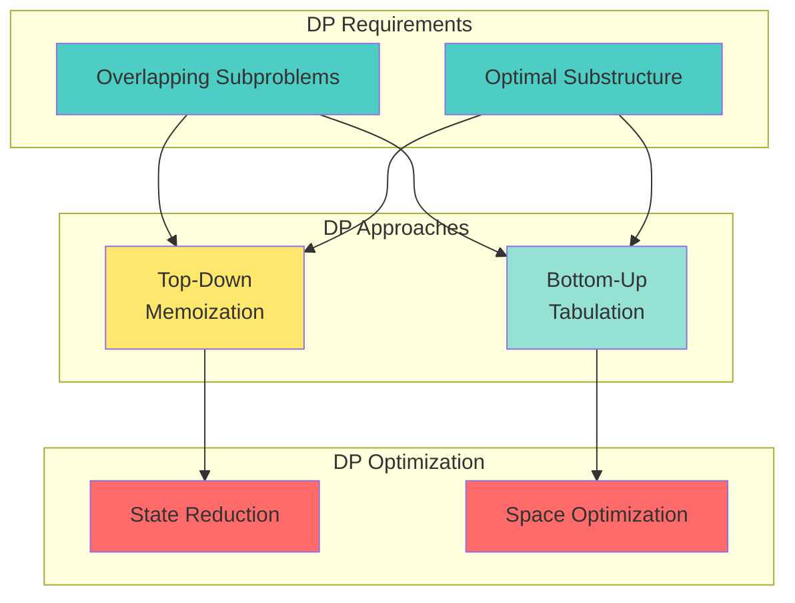

# 📘 **PROBLEM SOLVING MASTERY - Lesson 9: Dynamic Programming**

**Date**: 23-03-26
**Level**: 🟢 Beginner → 🔴 FAANG Ready
**Series**: DSA & Interview Preparation
**Time**: 150 minutes
**Prerequisites**: Lesson 1-8 (All previous lessons, especially Recursion)

---

## 🎯 **LEARNING OBJECTIVES**

After completing this **comprehensive** lesson, you will:

1. ✅ **Understand DP Fundamentals** - Overlapping subproblems, optimal substructure
2. ✅ **Master Memoization** - Top-down approach with caching
3. ✅ **Master Tabulation** - Bottom-up approach with iteration
4. ✅ **Recognize DP Patterns** - 1D, 2D, knapsack, LCS, LIS, matrix DP
5. ✅ **Solve Classic DP Problems** - Climbing stairs, house robber, coin change, etc.
6. ✅ **Tackle FAANG DP Problems** - Real interview questions with detailed solutions

---

## 📦 **PART 1: DP FUNDAMENTALS**

### **What is Dynamic Programming?**



---

### **DP vs Recursion vs Greedy**

```javascript
// ─────────────────────────────────────────────
// RECURSION (No Memoization)
// ─────────────────────────────────────────────
// Fibonacci: O(2^n) - Exponential!
function fibRecursive(n) {
  if (n <= 1) return n;
  return fibRecursive(n - 1) + fibRecursive(n - 2);
}

// Recursion tree for fib(5):
//                    fib(5)
//                   /      \
//              fib(4)      fib(3)
//             /     \      /     \
//        fib(3)  fib(2)  fib(2)  fib(1)
//        /   \    /  \    /  \
//   fib(2) fib(1) ...  ...  ...
//   /   \
// fib(1) fib(0)

// Notice: fib(3) computed 2 times, fib(2) computed 3 times!

// ─────────────────────────────────────────────
// MEMOIZATION (Top-Down DP)
// ─────────────────────────────────────────────
// Fibonacci: O(n) - Linear!
function fibMemo(n, memo = {}) {
  if (n in memo) return memo[n];  // Return cached result
  if (n <= 1) return n;
  
  memo[n] = fibMemo(n - 1, memo) + fibMemo(n - 2, memo);
  return memo[n];
}

// Each subproblem computed ONLY ONCE!

// ─────────────────────────────────────────────
// TABULATION (Bottom-Up DP)
// ─────────────────────────────────────────────
// Fibonacci: O(n) - Linear, no recursion!
function fibTabulation(n) {
  if (n <= 1) return n;
  
  const dp = new Array(n + 1);
  dp[0] = 0;
  dp[1] = 1;
  
  for (let i = 2; i <= n; i++) {
    dp[i] = dp[i - 1] + dp[i - 2];
  }
  
  return dp[n];
}

// ─────────────────────────────────────────────
// SPACE OPTIMIZED TABULATION
// ─────────────────────────────────────────────
// Fibonacci: O(n) time, O(1) space!
function fibOptimized(n) {
  if (n <= 1) return n;
  
  let prev2 = 0;  // fib(i-2)
  let prev1 = 1;  // fib(i-1)
  
  for (let i = 2; i <= n; i++) {
    const current = prev1 + prev2;
    prev2 = prev1;
    prev1 = current;
  }
  
  return prev1;
}
```

---

### **When to Use DP**

```javascript
// ─────────────────────────────────────────────
// DP WORKS WHEN:
// ─────────────────────────────────────────────
// 1. Problem can be broken into subproblems
// 2. Subproblems overlap (same subproblem solved multiple times)
// 3. Optimal solution contains optimal solutions to subproblems

// ─────────────────────────────────────────────
// DP DOESN'T WORK WHEN:
// ─────────────────────────────────────────────
// 1. No overlapping subproblems (use divide & conquer)
// 2. Greedy choice property holds (use greedy)
// 3. Subproblems are independent

// ─────────────────────────────────────────────
// RECOGNIZING DP PROBLEMS
// ─────────────────────────────────────────────
// Look for keywords:
// - "Maximum/Minimum"
// - "Number of ways"
// - "Count all ways"
// - "Optimal"
// - "In how many ways"
// - "Find all possible"

// Common patterns:
// - Optimization problems
// - Counting problems
// - Decision problems (can/cannot)
```

---

## 📦 **PART 2: 1D DP PATTERNS**

### **Climbing Stairs Pattern**

```javascript
// ─────────────────────────────────────────────
// CLIMBING STAIRS - LeetCode 70
// ─────────────────────────────────────────────
// Problem: You can climb 1 or 2 steps at a time.
// How many distinct ways to reach step n?

// Approach 1: Memoization
function climbStairsMemo(n, memo = {}) {
  if (n in memo) return memo[n];
  if (n <= 2) return n;
  
  memo[n] = climbStairsMemo(n - 1, memo) + climbStairsMemo(n - 2, memo);
  return memo[n];
}

// Approach 2: Tabulation
function climbStairsTab(n) {
  if (n <= 2) return n;
  
  const dp = new Array(n + 1);
  dp[1] = 1;
  dp[2] = 2;
  
  for (let i = 3; i <= n; i++) {
    dp[i] = dp[i - 1] + dp[i - 2];
  }
  
  return dp[n];
}

// Approach 3: Space Optimized
function climbStairsOpt(n) {
  if (n <= 2) return n;
  
  let prev2 = 1;  // ways to reach step 1
  let prev1 = 2;  // ways to reach step 2
  
  for (let i = 3; i <= n; i++) {
    const current = prev1 + prev2;
    prev2 = prev1;
    prev1 = current;
  }
  
  return prev1;
}

// Time: O(n), Space: O(1)

// ─────────────────────────────────────────────
// MIN COST CLIMBING STAIRS - LeetCode 746
// ─────────────────────────────────────────────
function minCostClimbingStairs(cost) {
  const n = cost.length;
  
  // dp[i] = minimum cost to reach step i
  const dp = new Array(n + 1);
  dp[0] = 0;
  dp[1] = 0;  // Can start from step 0 or 1
  
  for (let i = 2; i <= n; i++) {
    dp[i] = Math.min(
      dp[i - 1] + cost[i - 1],  // Come from i-1
      dp[i - 2] + cost[i - 2]   // Come from i-2
    );
  }
  
  return dp[n];
}

// Space optimized
function minCostOpt(cost) {
  let prev2 = 0;
  let prev1 = 0;
  
  for (let i = 2; i <= cost.length; i++) {
    const current = Math.min(
      prev1 + cost[i - 1],
      prev2 + cost[i - 2]
    );
    prev2 = prev1;
    prev1 = current;
  }
  
  return prev1;
}
```

---

### **House Robber Pattern**

```javascript
// ─────────────────────────────────────────────
// HOUSE ROBBER - LeetCode 198
// ─────────────────────────────────────────────
// Problem: Rob houses arranged in a line.
// Cannot rob adjacent houses. Maximize money.

// Approach 1: Memoization
function robMemo(nums, i = 0, memo = {}) {
  if (i >= nums.length) return 0;
  if (i in memo) return memo[i];
  
  // Choice: rob current or skip
  const robCurrent = nums[i] + robMemo(nums, i + 2, memo);
  const skipCurrent = robMemo(nums, i + 1, memo);
  
  memo[i] = Math.max(robCurrent, skipCurrent);
  return memo[i];
}

// Approach 2: Tabulation
function robTab(nums) {
  const n = nums.length;
  if (n === 0) return 0;
  if (n === 1) return nums[0];
  
  const dp = new Array(n);
  dp[0] = nums[0];
  dp[1] = Math.max(nums[0], nums[1]);
  
  for (let i = 2; i < n; i++) {
    dp[i] = Math.max(
      dp[i - 1],           // Skip current house
      dp[i - 2] + nums[i]  // Rob current house
    );
  }
  
  return dp[n - 1];
}

// Approach 3: Space Optimized
function robOpt(nums) {
  let prev2 = 0;  // max money up to i-2
  let prev1 = 0;  // max money up to i-1
  
  for (const num of nums) {
    const current = Math.max(prev1, prev2 + num);
    prev2 = prev1;
    prev1 = current;
  }
  
  return prev1;
}

// Time: O(n), Space: O(1)

// ─────────────────────────────────────────────
// HOUSE ROBBER II - Circular Houses - LeetCode 213
// ─────────────────────────────────────────────
function robCircular(nums) {
  if (nums.length === 1) return nums[0];
  
  // Two cases: rob first house OR rob last house (not both)
  return Math.max(
    robLinear(nums.slice(0, -1)),  // Exclude last
    robLinear(nums.slice(1))        // Exclude first
  );
}

function robLinear(nums) {
  let prev2 = 0, prev1 = 0;
  for (const num of nums) {
    const current = Math.max(prev1, prev2 + num);
    prev2 = prev1;
    prev1 = current;
  }
  return prev1;
}

// ─────────────────────────────────────────────
// HOUSE ROBBER III - Binary Tree - LeetCode 337
// ─────────────────────────────────────────────
function robTree(root) {
  function dfs(node) {
    if (!node) return [0, 0];  // [rob, skip]
    
    const left = dfs(node.left);
    const right = dfs(node.right);
    
    // If we rob current, we must skip children
    const robCurrent = node.val + left[1] + right[1];
    
    // If we skip current, we can choose best for children
    const skipCurrent = Math.max(...left) + Math.max(...right);
    
    return [robCurrent, skipCurrent];
  }
  
  const result = dfs(root);
  return Math.max(...result);
}

// Time: O(n), Space: O(h) for recursion
```

---

### **Coin Change Pattern**

```javascript
// ─────────────────────────────────────────────
// COIN CHANGE - LeetCode 322
// ─────────────────────────────────────────────
// Problem: Find minimum coins to make amount.

function coinChange(coins, amount) {
  // dp[i] = minimum coins to make amount i
  const dp = new Array(amount + 1).fill(Infinity);
  dp[0] = 0;
  
  for (const coin of coins) {
    for (let i = coin; i <= amount; i++) {
      dp[i] = Math.min(dp[i], dp[i - coin] + coin);
    }
  }
  
  return dp[amount] === Infinity ? -1 : dp[amount];
}

// Visualization for coins = [1, 2, 5], amount = 11:
// dp[0] = 0
// dp[1] = 1 (1)
// dp[2] = 1 (2)
// dp[3] = 2 (1+2)
// dp[4] = 2 (2+2)
// dp[5] = 1 (5)
// dp[6] = 2 (1+5)
// ...
// dp[11] = 3 (5+5+1)

// Time: O(amount × coins), Space: O(amount)

// ─────────────────────────────────────────────
// COIN CHANGE II - Number of Ways - LeetCode 518
// ─────────────────────────────────────────────
function change(amount, coins) {
  // dp[i] = number of ways to make amount i
  const dp = new Array(amount + 1).fill(0);
  dp[0] = 1;  // One way to make 0 (use no coins)
  
  for (const coin of coins) {
    for (let i = coin; i <= amount; i++) {
      dp[i] += dp[i - coin];
    }
  }
  
  return dp[amount];
}

// Key difference from Coin Change I:
// - We're counting ways, not minimizing
// - Order doesn't matter (combinations, not permutations)
// - Outer loop is coins (to avoid counting permutations)

// Time: O(amount × coins), Space: O(amount)

// ─────────────────────────────────────────────
// COMBINATION SUM IV - Permutations - LeetCode 377
// ─────────────────────────────────────────────
function combinationSum4(nums, target) {
  // dp[i] = number of ways to make sum i
  const dp = new Array(target + 1).fill(0);
  dp[0] = 1;
  
  // Different from Coin Change II: outer loop is target
  // This counts permutations (order matters)
  for (let i = 1; i <= target; i++) {
    for (const num of nums) {
      if (i >= num) {
        dp[i] += dp[i - num];
      }
    }
  }
  
  return dp[target];
}

// Time: O(target × nums), Space: O(target)
```

---

## 📦 **PART 3: 2D DP PATTERNS**

### **Longest Common Subsequence**

```javascript
// ─────────────────────────────────────────────
// LONGEST COMMON SUBSEQUENCE - LeetCode 1143
// ─────────────────────────────────────────────
// Problem: Find length of longest common subsequence.

function longestCommonSubsequence(text1, text2) {
  const m = text1.length;
  const n = text2.length;
  
  // dp[i][j] = LCS of text1[0..i-1] and text2[0..j-1]
  const dp = Array.from({ length: m + 1 }, () => 
    new Array(n + 1).fill(0)
  );
  
  for (let i = 1; i <= m; i++) {
    for (let j = 1; j <= n; j++) {
      if (text1[i - 1] === text2[j - 1]) {
        dp[i][j] = dp[i - 1][j - 1] + 1;
      } else {
        dp[i][j] = Math.max(dp[i - 1][j], dp[i][j - 1]);
      }
    }
  }
  
  return dp[m][n];
}

// Visualization:
// text1 = "abcde", text2 = "ace"
//       ""  a   c   e
// ""    0   0   0   0
// a     0   1   1   1
// b     0   1   1   1
// c     0   1   2   2
// d     0   1   2   2
// e     0   1   2   3  ← Answer: 3 ("ace")

// Time: O(m × n), Space: O(m × n)

// ─────────────────────────────────────────────
// LCS - SPACE OPTIMIZED
// ─────────────────────────────────────────────
function longestCommonSubsequenceOpt(text1, text2) {
  const m = text1.length;
  const n = text2.length;
  
  // Only need previous row
  let prev = new Array(n + 1).fill(0);
  let curr = new Array(n + 1).fill(0);
  
  for (let i = 1; i <= m; i++) {
    for (let j = 1; j <= n; j++) {
      if (text1[i - 1] === text2[j - 1]) {
        curr[j] = prev[j - 1] + 1;
      } else {
        curr[j] = Math.max(prev[j], curr[j - 1]);
      }
    }
    prev = [...curr];
  }
  
  return prev[n];
}

// Time: O(m × n), Space: O(n)

// ─────────────────────────────────────────────
// LONGEST PALINDROMIC SUBSEQUENCE - LeetCode 516
// ─────────────────────────────────────────────
function longestPalindromeSubseq(s) {
  const n = s.length;
  
  // dp[i][j] = LPS length in s[i..j]
  const dp = Array.from({ length: n }, () => 
    new Array(n).fill(0)
  );
  
  // Every single character is a palindrome of length 1
  for (let i = 0; i < n; i++) {
    dp[i][i] = 1;
  }
  
  // Fill by length of substring
  for (let len = 2; len <= n; len++) {
    for (let i = 0; i <= n - len; i++) {
      const j = i + len - 1;
      
      if (s[i] === s[j]) {
        dp[i][j] = dp[i + 1][j - 1] + 2;
      } else {
        dp[i][j] = Math.max(dp[i + 1][j], dp[i][j - 1]);
      }
    }
  }
  
  return dp[0][n - 1];
}

// Time: O(n²), Space: O(n²)
```

---

### **Edit Distance Pattern**

```javascript
// ─────────────────────────────────────────────
// EDIT DISTANCE - LeetCode 72
// ─────────────────────────────────────────────
// Problem: Minimum operations to convert word1 to word2.
// Operations: insert, delete, replace

function minDistance(word1, word2) {
  const m = word1.length;
  const n = word2.length;
  
  // dp[i][j] = min operations to convert word1[0..i-1] to word2[0..j-1]
  const dp = Array.from({ length: m + 1 }, () => 
    new Array(n + 1).fill(0)
  );
  
  // Base cases
  for (let i = 0; i <= m; i++) dp[i][0] = i;  // Delete all
  for (let j = 0; j <= n; j++) dp[0][j] = j;  // Insert all
  
  for (let i = 1; i <= m; i++) {
    for (let j = 1; j <= n; j++) {
      if (word1[i - 1] === word2[j - 1]) {
        dp[i][j] = dp[i - 1][j - 1];  // No operation needed
      } else {
        dp[i][j] = 1 + Math.min(
          dp[i - 1][j],     // Delete from word1
          dp[i][j - 1],     // Insert into word1
          dp[i - 1][j - 1]  // Replace
        );
      }
    }
  }
  
  return dp[m][n];
}

// Time: O(m × n), Space: O(m × n)

// ─────────────────────────────────────────────
// DELETE OPERATION FOR TWO STRINGS - LeetCode 583
// ─────────────────────────────────────────────
function minDistanceDelete(word1, word2) {
  // Find LCS, then delete remaining characters
  const lcs = longestCommonSubsequence(word1, word2);
  return word1.length + word2.length - 2 * lcs;
}

// ─────────────────────────────────────────────
// SHORTest COMMON SUPERSEQUENCE - LeetCode 1092
// ─────────────────────────────────────────────
function shortestCommonSupersequence(str1, str2) {
  const m = str1.length;
  const n = str2.length;
  
  const dp = Array.from({ length: m + 1 }, () => 
    new Array(n + 1).fill(0)
  );
  
  // Fill DP table (same as LCS)
  for (let i = 1; i <= m; i++) {
    for (let j = 1; j <= n; j++) {
      if (str1[i - 1] === str2[j - 1]) {
        dp[i][j] = dp[i - 1][j - 1] + 1;
      } else {
        dp[i][j] = Math.max(dp[i - 1][j], dp[i][j - 1]);
      }
    }
  }
  
  // Backtrack to build supersequence
  let i = m, j = n;
  const result = [];
  
  while (i > 0 && j > 0) {
    if (str1[i - 1] === str2[j - 1]) {
      result.push(str1[i - 1]);
      i--;
      j--;
    } else if (dp[i - 1][j] > dp[i][j - 1]) {
      result.push(str1[i - 1]);
      i--;
    } else {
      result.push(str2[j - 1]);
      j--;
    }
  }
  
  // Add remaining characters
  while (i > 0) result.push(str1[--i]);
  while (j > 0) result.push(str2[--j]);
  
  return result.reverse().join('');
}
```

---

### **0/1 Knapsack Pattern**

```javascript
// ─────────────────────────────────────────────
// 0/1 KNAPSACK PROBLEM
// ─────────────────────────────────────────────
// Problem: Given weights and values, maximize value
// with weight constraint. Each item can be taken once.

function knapsack(weights, values, capacity) {
  const n = weights.length;
  
  // dp[i][w] = max value using first i items with capacity w
  const dp = Array.from({ length: n + 1 }, () => 
    new Array(capacity + 1).fill(0)
  );
  
  for (let i = 1; i <= n; i++) {
    for (let w = 0; w <= capacity; w++) {
      // Don't take item i
      dp[i][w] = dp[i - 1][w];
      
      // Take item i (if it fits)
      if (weights[i - 1] <= w) {
        dp[i][w] = Math.max(
          dp[i][w],
          dp[i - 1][w - weights[i - 1]] + values[i - 1]
        );
      }
    }
  }
  
  return dp[n][capacity];
}

// Time: O(n × capacity), Space: O(n × capacity)

// ─────────────────────────────────────────────
// PARTITION EQUAL SUBSET SUM - LeetCode 416
// ─────────────────────────────────────────────
function canPartition(nums) {
  const sum = nums.reduce((a, b) => a + b, 0);
  
  // If sum is odd, can't partition equally
  if (sum % 2 !== 0) return false;
  
  const target = sum / 2;
  
  // dp[w] = can we make sum w?
  const dp = new Array(target + 1).fill(false);
  dp[0] = true;
  
  for (const num of nums) {
    // Traverse backwards to avoid using same element twice
    for (let w = target; w >= num; w--) {
      dp[w] = dp[w] || dp[w - num];
    }
  }
  
  return dp[target];
}

// This is a 0/1 knapsack variant!
// Time: O(n × sum), Space: O(sum)

// ─────────────────────────────────────────────
// TARGET SUM - LeetCode 494
// ─────────────────────────────────────────────
function findTargetSumWays(nums, target) {
  const sum = nums.reduce((a, b) => a + b, 0);
  
  // If target is out of range or (sum + target) is odd
  if (Math.abs(target) > sum || (sum + target) % 2 !== 0) {
    return 0;
  }
  
  // Convert to subset sum problem
  // positive - negative = target
  // positive + negative = sum
  // 2 * positive = sum + target
  const positiveSum = (sum + target) / 2;
  
  const dp = new Array(positiveSum + 1).fill(0);
  dp[0] = 1;
  
  for (const num of nums) {
    for (let w = positiveSum; w >= num; w--) {
      dp[w] += dp[w - num];
    }
  }
  
  return dp[positiveSum];
}
```

---

## 📦 **PART 4: LONGEST INCREASING SUBSEQUENCE**

```javascript
// ─────────────────────────────────────────────
// LONGEST INCREASING SUBSEQUENCE - LeetCode 300
// ─────────────────────────────────────────────
// Problem: Find length of longest increasing subsequence.

// Approach 1: DP O(n²)
function lengthOfLIS(nums) {
  if (nums.length === 0) return 0;
  
  // dp[i] = length of LIS ending at index i
  const dp = new Array(nums.length).fill(1);
  
  for (let i = 1; i < nums.length; i++) {
    for (let j = 0; j < i; j++) {
      if (nums[j] < nums[i]) {
        dp[i] = Math.max(dp[i], dp[j] + 1);
      }
    }
  }
  
  return Math.max(...dp);
}

// Approach 2: Binary Search O(n log n)
function lengthOfLISOptimal(nums) {
  const tails = [];  // tails[i] = smallest tail for LIS of length i+1
  
  for (const num of nums) {
    // Binary search for insertion position
    let left = 0, right = tails.length;
    
    while (left < right) {
      const mid = Math.floor((left + right) / 2);
      if (tails[mid] < num) {
        left = mid + 1;
      } else {
        right = mid;
      }
    }
    
    tails[left] = num;
  }
  
  return tails.length;
}

// Example: nums = [10, 9, 2, 5, 3, 7, 101, 18]
// tails evolution:
// [10]
// [9]
// [2]
// [2, 5]
// [2, 3]
// [2, 3, 7]
// [2, 3, 7, 101]
// [2, 3, 7, 18]
// Length: 4 (actual LIS: [2, 3, 7, 18] or [2, 5, 7, 101])

// Time: O(n log n), Space: O(n)

// ─────────────────────────────────────────────
// NUMBER OF LONGEST INCREASING SUBSEQUENCE - LeetCode 673
// ─────────────────────────────────────────────
function findNumberOfLIS(nums) {
  const n = nums.length;
  if (n === 0) return 0;
  
  // lengths[i] = length of LIS ending at i
  // counts[i] = count of LIS ending at i
  const lengths = new Array(n).fill(1);
  const counts = new Array(n).fill(1);
  
  for (let i = 1; i < n; i++) {
    for (let j = 0; j < i; j++) {
      if (nums[j] < nums[i]) {
        if (lengths[j] + 1 > lengths[i]) {
          lengths[i] = lengths[j] + 1;
          counts[i] = counts[j];
        } else if (lengths[j] + 1 === lengths[i]) {
          counts[i] += counts[j];
        }
      }
    }
  }
  
  const maxLen = Math.max(...lengths);
  let totalCount = 0;
  
  for (let i = 0; i < n; i++) {
    if (lengths[i] === maxLen) {
      totalCount += counts[i];
    }
  }
  
  return totalCount;
}
```

---

## 📦 **PART 5: MATRIX DP**

### **Unique Paths**

```javascript
// ─────────────────────────────────────────────
// UNIQUE PATHS - LeetCode 62
// ─────────────────────────────────────────────
// Problem: Count paths from top-left to bottom-right.
// Can only move right or down.

function uniquePaths(m, n) {
  // dp[i][j] = number of paths to reach cell (i, j)
  const dp = Array.from({ length: m }, () => 
    new Array(n).fill(1)  // First row and column all have 1 path
  );
  
  for (let i = 1; i < m; i++) {
    for (let j = 1; j < n; j++) {
      dp[i][j] = dp[i - 1][j] + dp[i][j - 1];
      // Paths from above + paths from left
    }
  }
  
  return dp[m - 1][n - 1];
}

// Time: O(m × n), Space: O(m × n)

// Space optimized
function uniquePathsOpt(m, n) {
  const dp = new Array(n).fill(1);
  
  for (let i = 1; i < m; i++) {
    for (let j = 1; j < n; j++) {
      dp[j] += dp[j];  // dp[j] (from above) + dp[j-1] (from left)
    }
  }
  
  return dp[n - 1];
}

// ─────────────────────────────────────────────
// UNIQUE PATHS II - With Obstacles - LeetCode 63
// ─────────────────────────────────────────────
function uniquePathsWithObstacles(obstacleGrid) {
  const m = obstacleGrid.length;
  const n = obstacleGrid[0].length;
  
  // If start or end is blocked
  if (obstacleGrid[0][0] === 1 || obstacleGrid[m - 1][n - 1] === 1) {
    return 0;
  }
  
  const dp = Array.from({ length: m }, () => 
    new Array(n).fill(0)
  );
  
  dp[0][0] = 1;
  
  // First row
  for (let j = 1; j < n; j++) {
    dp[0][j] = obstacleGrid[0][j] === 0 ? dp[0][j - 1] : 0;
  }
  
  // First column
  for (let i = 1; i < m; i++) {
    dp[i][0] = obstacleGrid[i][0] === 0 ? dp[i - 1][0] : 0;
  }
  
  // Rest of the grid
  for (let i = 1; i < m; i++) {
    for (let j = 1; j < n; j++) {
      if (obstacleGrid[i][j] === 0) {
        dp[i][j] = dp[i - 1][j] + dp[i][j - 1];
      }
    }
  }
  
  return dp[m - 1][n - 1];
}

// ─────────────────────────────────────────────
// MINIMUM PATH SUM - LeetCode 64
// ─────────────────────────────────────────────
function minPathSum(grid) {
  const m = grid.length;
  const n = grid[0].length;
  
  const dp = Array.from({ length: m }, () => 
    new Array(n).fill(0)
  );
  
  dp[0][0] = grid[0][0];
  
  // First row
  for (let j = 1; j < n; j++) {
    dp[0][j] = dp[0][j - 1] + grid[0][j];
  }
  
  // First column
  for (let i = 1; i < m; i++) {
    dp[i][0] = dp[i - 1][0] + grid[i][0];
  }
  
  // Rest of the grid
  for (let i = 1; i < m; i++) {
    for (let j = 1; j < n; j++) {
      dp[i][j] = Math.min(dp[i - 1][j], dp[i][j - 1]) + grid[i][j];
    }
  }
  
  return dp[m - 1][n - 1];
}

// Space optimized (modify grid in-place)
function minPathSumInPlace(grid) {
  const m = grid.length;
  const n = grid[0].length;
  
  for (let i = 0; i < m; i++) {
    for (let j = 0; j < n; j++) {
      if (i === 0 && j === 0) continue;
      else if (i === 0) grid[i][j] += grid[i][j - 1];
      else if (j === 0) grid[i][j] += grid[i - 1][j];
      else grid[i][j] += Math.min(grid[i - 1][j], grid[i][j - 1]);
    }
  }
  
  return grid[m - 1][n - 1];
}
```

---

## 📦 **PART 6: INTERVAL DP**

```javascript
// ─────────────────────────────────────────────
// BURST BALLOONS - LeetCode 312
// ─────────────────────────────────────────────
function maxCoins(nums) {
  // Add boundary balloons with value 1
  const arr = [1, ...nums, 1];
  const n = arr.length;
  
  // dp[i][j] = max coins from bursting balloons in range (i, j) exclusive
  const dp = Array.from({ length: n }, () => 
    new Array(n).fill(0)
  );
  
  // Fill by length of range
  for (let len = 2; len < n; len++) {
    for (let left = 0; left < n - len; left++) {
      const right = left + len;
      
      // Try each balloon as the last one to burst
      for (let last = left + 1; last < right; last++) {
        const coins = arr[left] * arr[last] * arr[right] +
                      dp[left][last] + dp[last][right];
        dp[left][right] = Math.max(dp[left][right], coins);
      }
    }
  }
  
  return dp[0][n - 1];
}

// Time: O(n³), Space: O(n²)

// ─────────────────────────────────────────────
// MATRIX CHAIN MULTIPLICATION
// ─────────────────────────────────────────────
function matrixChainOrder(dims) {
  const n = dims.length - 1;
  
  // dp[i][j] = minimum multiplications for matrices i to j
  const dp = Array.from({ length: n + 1 }, () => 
    new Array(n + 1).fill(0)
  );
  
  for (let len = 2; len <= n; len++) {
    for (let i = 0; i < n - len + 1; i++) {
      const j = i + len - 1;
      dp[i][j] = Infinity;
      
      for (let k = i; k < j; k++) {
        const cost = dp[i][k] + dp[k + 1][j] + 
                     dims[i] * dims[k + 1] * dims[j + 1];
        dp[i][j] = Math.min(dp[i][j], cost);
      }
    }
  }
  
  return dp[0][n - 1];
}
```

---

## ✅ **DYNAMIC PROGRAMMING CHECKLIST**

```
1D DP Patterns
[ ] Climbing stairs
[ ] House robber
[ ] Coin change
[ ] Fibonacci variants

2D DP Patterns
[ ] Longest common subsequence
[ ] Edit distance
[ ] 0/1 knapsack
[ ] Partition problems

Sequence DP
[ ] Longest increasing subsequence
[ ] Longest palindromic subsequence
[ ] Number of ways

Matrix DP
[ ] Unique paths
[ ] Minimum path sum
[ ] Maximum square

Interval DP
[ ] Burst balloons
[ ] Matrix chain multiplication
[ ] Palindrome partitioning

DP Techniques
[ ] Memoization (top-down)
[ ] Tabulation (bottom-up)
[ ] Space optimization
[ ] State reduction
```

---

## 🎯 **KNOWLEDGE CHECK**

### **Question 1: DP vs Greedy**

When should you use DP instead of greedy?

<details>
<summary>💡 Click to reveal answer</summary>

**Use DP when:**
- Greedy choice doesn't guarantee optimal solution
- You need to explore multiple choices
- Subproblems overlap

**Example - Coin Change:**
- Greedy: Take largest coin first
- For coins [1, 3, 4] and target 6:
  - Greedy: 4 + 1 + 1 = 3 coins
  - DP (optimal): 3 + 3 = 2 coins

**Greedy works when:**
- Greedy choice property holds
- Local optimum leads to global optimum
</details>

---

### **Question 2: DP State Definition**

How do you define the DP state for a new problem?

<details>
<summary>💡 Click to reveal answer</summary>

**Steps to define DP state:**

1. **Identify what you're trying to compute**
   - Maximum/minimum value?
   - Number of ways?
   - Yes/no decision?

2. **Identify the parameters that define a subproblem**
   - Index in array?
   - Remaining capacity?
   - Current sum?

3. **Write the recurrence relation**
   - How does the answer depend on smaller subproblems?

4. **Identify base cases**
   - What are the simplest subproblems?

**Example - House Robber:**
- State: dp[i] = max money from houses 0 to i
- Recurrence: dp[i] = max(dp[i-1], dp[i-2] + nums[i])
- Base: dp[0] = nums[0], dp[1] = max(nums[0], nums[1])
</details>

---

## 📚 **PRACTICE PROBLEMS**

### **Easy**
- Climbing Stairs (LeetCode 70)
- Min Cost Climbing Stairs (LeetCode 746)
- Maximum Subarray (LeetCode 53)

### **Medium**
- House Robber (LeetCode 198)
- Coin Change (LeetCode 322)
- Longest Common Subsequence (LeetCode 1143)
- Longest Increasing Subsequence (LeetCode 300)
- Unique Paths (LeetCode 62)
- Partition Equal Subset Sum (LeetCode 416)

### **Hard**
- Edit Distance (LeetCode 72)
- Burst Balloons (LeetCode 312)
- Regular Expression Matching (LeetCode 10)
- Word Break II (LeetCode 140)

---

## 🎓 **HOMEWORK**

1. ✅ Solve 10 1D DP problems
2. ✅ Solve 10 2D DP problems
3. ✅ Implement each pattern from memory
4. ✅ Practice identifying DP problems
5. ✅ Time yourself: 3 medium DP problems in 60 minutes

---

**Next Lesson**: Interview Preparation - Mock Interviews, Behavioral, Negotiation
**Date**: 23-03-26
**Status**: ✅ Complete

---
-23-03-26
