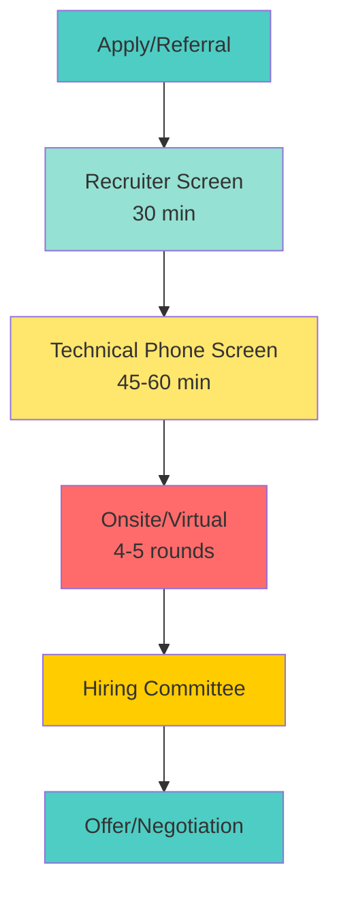
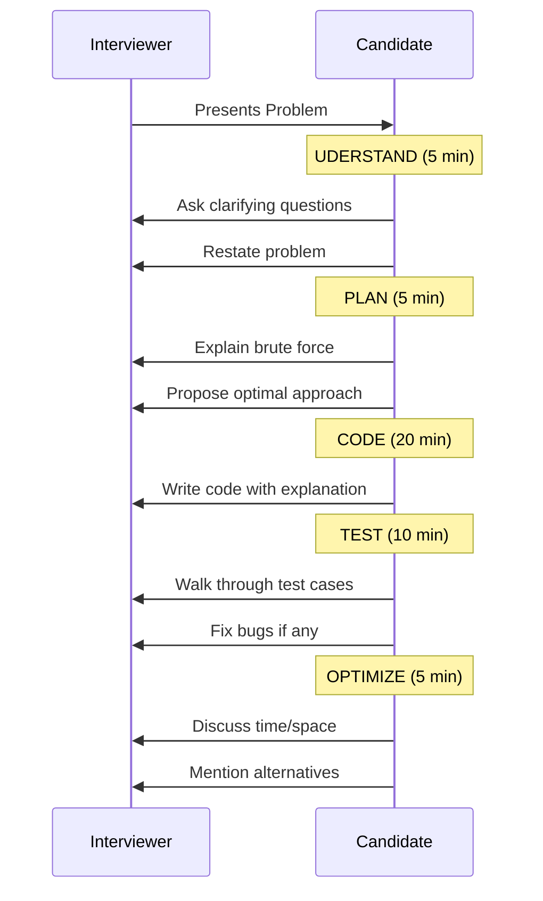
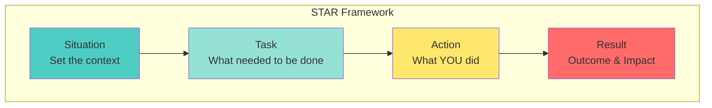
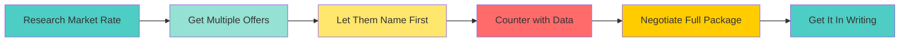

# 📘 **PROBLEM SOLVING MASTERY - Lesson 10: Interview Preparation**

**Date**: 23-03-26
**Level**: 🟢 Beginner → 🔴 FAANG Ready
**Series**: DSA & Interview Preparation
**Time**: 90 minutes
**Prerequisites**: Lesson 1-9 (All DSA topics)
- [LastRead](#lastRead)
---

## 🎯 **LEARNING OBJECTIVES**

After completing this **comprehensive** lesson, you will:

1. ✅ **Master Technical Interview Format** - Phone screens, onsite, virtual rounds
2. ✅ **Ace Coding Interviews** - Problem-solving framework, communication, testing
3. ✅ **Master Behavioral Questions** - STAR method, common questions, stories
4. ✅ **Optimize Your Resume** - ATS-friendly, impact bullets, projects
5. ✅ **Negotiate Offers** - Salary research, negotiation tactics, multiple offers
6. ✅ **Create Interview Strategy** - Study plan, company research, follow-up

---

## 📦 **PART 1: INTERVIEW FORMATS**

### **FAANG Interview Process**



---

### **Interview Round Breakdown**

```javascript
// ─────────────────────────────────────────────
// TYPICAL FAANG ONSITE (5 ROUNDS)
// ─────────────────────────────────────────────
const interviewRounds = {
  // Round 1: Coding - Arrays/Strings (45 min)
  coding1: {
    topics: ['Arrays', 'Strings', 'Hash Maps'],
    difficulty: 'Medium',
    questions: 1-2,
  },
  
  // Round 2: Coding - Data Structures (45 min)
  coding2: {
    topics: ['Trees', 'Graphs', 'Linked Lists'],
    difficulty: 'Medium-Hard',
    questions: 1-2,
  },
  
  // Round 3: System Design (45-60 min)
  // (For L4+ positions)
  systemDesign: {
    topics: ['Scalability', 'Database Design', 'Caching'],
    difficulty: 'Varies',
    questions: 1,
  },
  
  // Round 4: Behavioral (45-60 min)
  behavioral: {
    topics: ['Leadership Principles', 'Culture Fit'],
    difficulty: 'N/A',
    questions: 5-10,
  },
  
  // Round 5: Coding or Specialized (45 min)
  coding3: {
    topics: ['DP', 'Greedy', 'Domain-specific'],
    difficulty: 'Medium-Hard',
    questions: 1-2,
  },
};

// ─────────────────────────────────────────────
// TIME ALLOCATION DURING CODING ROUND
// ─────────────────────────────────────────────
const timeAllocation = {
  understand: '5-10 minutes',    // Clarify, ask questions
  plan: '5-10 minutes',          // Discuss approach, complexity
  code: '15-20 minutes',         // Write clean code
  test: '5-10 minutes',          // Test with examples
  optimize: '5 minutes',         // Discuss improvements
};

// Total: 45-60 minutes
```

---

## 📦 **PART 2: CODING INTERVIEW STRATEGY**

### **Problem-Solving Framework**



---

### **Communication Templates**

```javascript
// ─────────────────────────────────────────────
// CLARIFYING QUESTIONS
// ─────────────────────────────────────────────
const clarifyingQuestions = {
  input: [
    "What type of input should I expect? (array, string, tree?)",
    "Can the input be empty/null?",
    "What's the expected size of input?",
    "Are there any constraints on values? (negative, duplicates?)",
  ],
  
  output: [
    "What should I return? (value, index, boolean?)",
    "Should I modify the input in-place or return new data?",
    "What's the expected format of output?",
  ],
  
  edgeCases: [
    "How should I handle empty input?",
    "What if there are multiple valid answers?",
    "Should I handle invalid input?",
  ],
};

// ─────────────────────────────────────────────
// THINKING ALOUD SCRIPTS
// ─────────────────────────────────────────────
const thinkingAloud = {
  starting: [
    "Let me make sure I understand the problem correctly...",
    "So the goal is to...",
    "Let me think about the brute force approach first...",
  ],
  
  optimizing: [
    "The brute force would be O(n²), but I think we can do better...",
    "I notice that we're recalculating the same values...",
    "This looks like a [pattern name] problem because...",
  ],
  
  stuck: [
    "I'm considering using a hash map here to store...",
    "One approach could be to sort first, which would let us...",
    "I'm wondering if a two-pointer approach would work here...",
  ],
  
  testing: [
    "Let me trace through this example...",
    "Let me test with a simple case first...",
    "Now let me check an edge case...",
  ],
};

// ─────────────────────────────────────────────
// COMPLEXITY DISCUSSION
// ─────────────────────────────────────────────
function discussComplexity(solution) {
  console.log(`Time Complexity: ${solution.timeComplexity}`);
  console.log(`Space Complexity: ${solution.spaceComplexity}`);
  console.log(`
Potential Optimizations:
  - Could we reduce space by modifying input?
  - Could we use a different data structure?
  - Is there a mathematical formula?
  `);
}
```

---

### **Common Mistakes to Avoid**

```javascript
// ─────────────────────────────────────────────
// RED FLAGS
// ─────────────────────────────────────────────
const redFlags = {
  communication: [
    '❌ Silent coding (not thinking aloud)',
    '❌ Not asking clarifying questions',
    '❌ Ignoring interviewer hints',
    '❌ Arguing with interviewer',
  ],
  
  technical: [
    '❌ Jumping to code without planning',
    '❌ Not testing your solution',
    '❌ Ignoring edge cases',
    '❌ Writing buggy code repeatedly',
  ],
  
  attitude: [
    '❌ Giving up too easily',
    '❌ Getting frustrated',
    '❌ Being overconfident',
    '❌ Not accepting feedback',
  ],
};

// ─────────────────────────────────────────────
// GREEN FLAGS
// ─────────────────────────────────────────────
const greenFlags = {
  communication: [
    '✅ Thinking aloud consistently',
    '✅ Asking 2-3 clarifying questions',
    '✅ Acknowledging and using hints',
    '✅ Explaining trade-offs',
  ],
  
  technical: [
    '✅ Starting with brute force',
    '✅ Writing clean, readable code',
    '✅ Testing with multiple cases',
    '✅ Analyzing complexity',
  ],
  
  attitude: [
    '✅ Staying positive and confident',
    '✅ Being open to feedback',
    '✅ Showing enthusiasm',
    '✅ Professional throughout',
  ],
};
```

---

## 📦 **PART 3: BEHAVIORAL INTERVIEWS**

### **STAR Method**



---

### **STAR Method Examples**

```javascript
// ─────────────────────────────────────────────
// EXAMPLE: "Tell me about a time you faced a difficult technical challenge"
// ─────────────────────────────────────────────
const starExample = {
  situation: `
"In my previous role, our API was experiencing 5-second response times 
during peak hours, causing customer complaints and potential revenue loss."
  `,
  
  task: `
"I was tasked with reducing API latency to under 500ms within 2 weeks, 
without major architectural changes."
  `,
  
  action: `
"I took a systematic approach:
1. First, I profiled the API to identify bottlenecks using Chrome DevTools
2. Found that database queries were the main issue - N+1 queries
3. Implemented caching with Redis for frequently accessed data
4. Optimized queries using eager loading and indexes
5. Added monitoring to track improvements"
  `,
  
  result: `
"Results:
• Reduced average response time from 5s to 200ms (96% improvement)
• Customer complaints dropped by 90%
• System handled 3x traffic during next sale event
• My approach was documented and adopted by other teams"
  `,
};

// ─────────────────────────────────────────────
// COMMON BEHAVIORAL QUESTIONS
// ─────────────────────────────────────────────
const behavioralQuestions = {
  leadership: [
    "Tell me about a time you showed leadership",
    "Describe a time you had to make a difficult decision",
    "Tell me about a time you disagreed with your manager",
  ],
  
  teamwork: [
    "Tell me about a time you worked with a difficult teammate",
    "Describe a successful collaboration",
    "Tell me about a time you helped a teammate",
  ],
  
  failure: [
    "Tell me about a time you failed",
    "Describe a mistake you made and what you learned",
    "Tell me about a time you missed a deadline",
  ],
  
  conflict: [
    "Tell me about a time you had a conflict with a coworker",
    "Describe a time you received difficult feedback",
    "Tell me about a time you disagreed on technical approach",
  ],
  
  achievement: [
    "What's your proudest professional accomplishment?",
    "Tell me about a time you went above and beyond",
    "Describe your most impactful project",
  ],
};

// ─────────────────────────────────────────────
// PREPARING YOUR STORIES
// ─────────────────────────────────────────────
const storyBank = [
  {
    theme: 'Leadership',
    stories: [
      { title: 'Led migration to microservices', impact: 'Reduced deployment time by 80%' },
      { title: 'Mentored junior developers', impact: '2 promotees within 6 months' },
    ],
  },
  {
    theme: 'Technical Challenge',
    stories: [
      { title: 'Optimized slow API', impact: '96% latency reduction' },
      { title: 'Fixed production bug', impact: 'Saved $50K in potential losses' },
    ],
  },
  {
    theme: 'Conflict Resolution',
    stories: [
      { title: 'Resolved team disagreement', impact: 'Improved team velocity by 40%' },
    ],
  },
  {
    theme: 'Failure/Learning',
    stories: [
      { title: 'Deployed buggy code', impact: 'Implemented better testing practices' },
    ],
  },
];

// Prepare 5-7 stories that can be adapted to multiple questions
```

---

### **Amazon Leadership Principles**

```javascript
// ─────────────────────────────────────────────
// AMAZON LP EXAMPLES
// ─────────────────────────────────────────────
const amazonLPs = {
  customerObsession: {
    question: "Tell me about a time you went above and beyond for a customer",
    keyPoints: ['Started with customer need', 'Earned trust', 'Delivered results'],
  },
  
  ownership: {
    question: "Describe a time you took ownership of a problem",
    keyPoints: ['Didn\'t say "that\'s not my job"', 'Thought long-term', 'Acted on behalf of company'],
  },
  
  inventAndSimplify: {
    question: "Tell me about a time you simplified a complex problem",
    keyPoints: ['Looked for new ideas', 'Simplified process', 'Encouraged creativity'],
  },
  
  areRightALot: {
    question: "Describe a time you made a decision with incomplete information",
    keyPoints: ['Used data', 'Consulted experts', 'Made timely decision'],
  },
  
  learnAndBeCurious: {
    question: "Tell me about a time you learned something new quickly",
    keyPoints: ['Sought feedback', 'Learned from mistakes', 'Shared knowledge'],
  },
  
  hireAndDevelopBest: {
    question: "Describe a time you helped develop someone",
    keyPoints: ['Raised performance bar', 'Coached', 'Recognized achievements'],
  },
  
  insistOnHighestStandards: {
    question: "Tell me about a time you refused to compromise on quality",
    keyPoints: ['Set high standards', 'Fixed problems', 'Ensured quality'],
  },
  
  thinkBig: {
    question: "Describe a time you thought big about a problem",
    keyPoints: ['Created vision', 'Thought beyond current role', 'Inspired others'],
  },
  
  biasForAction: {
    question: "Tell me about a time you took quick action",
    keyPoints: ['Calculated risk', 'Speed matters', 'Disagreed and committed'],
  },
  
  frugality: {
    question: "Describe a time you accomplished more with less",
    keyPoints: ['Optimized resources', 'Innovated within constraints'],
  },
  
  earnTrust: {
    question: "Tell me about a time you built trust",
    keyPoints: ['Listened', 'Was transparent', 'Delivered commitments'],
  },
  
  diveDeep: {
    question: "Describe a time you dove deep into a problem",
    keyPoints: ['Operates at all levels', 'No task beneath', 'Audited regularly'],
  },
  
  haveBackboneDisagreeCommit: {
    question: "Tell me about a time you disagreed but committed",
    keyPoints: ['Respectfully challenged', 'Committed fully after decision'],
  },
  
  deliverResults: {
    question: "Describe a time you delivered results under pressure",
    keyPoints: ['Focused on key inputs', 'Delivered on time', 'Quality results'],
  },
  
  striveToBeEarthsBestEmployer: {
    question: "Tell me about a time you improved team culture",
    keyPoints: ['Made work better', 'Supported teammates', 'Improved processes'],
  },
  
  successAndScaleBringBroadResponsibility: {
    question: "Describe a time you considered broader impact",
    keyPoints: ['Thought beyond team', 'Considered community', 'Long-term thinking'],
  },
};
```

---

## 📦 **PART 4: RESUME OPTIMIZATION**

### **Resume Best Practices**

```javascript
// ─────────────────────────────────────────────
// RESUME STRUCTURE
// ─────────────────────────────────────────────
const resumeStructure = {
  header: {
    content: ['Name', 'Phone', 'Email', 'LinkedIn', 'GitHub', 'Location'],
    tips: ['Keep it clean', 'Professional email', 'Custom LinkedIn URL'],
  },
  
  summary: {
    content: ['2-3 lines', 'Key skills', 'Years of experience', 'Value proposition'],
    tips: ['Tailor to job', 'Use keywords', 'Quantify when possible'],
  },
  
  experience: {
    content: ['Company, Title, Dates', '3-5 bullet points per role'],
    tips: [
      'Start with action verbs',
      'Quantify impact',
      'Focus on achievements, not duties',
    ],
  },
  
  projects: {
    content: ['Project name', 'Technologies', '1-2 bullet points'],
    tips: ['Include personal projects', 'Link to GitHub', 'Show impact'],
  },
  
  education: {
    content: ['Degree, Major, University, Graduation'],
    tips: ['Include GPA if >3.5', 'Relevant coursework for new grads'],
  },
  
  skills: {
    content: ['Languages', 'Frameworks', 'Tools', 'Databases'],
    tips: ['Group by category', 'Only include proficient skills'],
  },
};

// ─────────────────────────────────────────────
// IMPACT BULLET FORMULA
// ─────────────────────────────────────────────
// Formula: Action Verb + Task + Result/Impact (Quantified)

const bulletExamples = {
  before: [
    '❌ Responsible for developing features',
    '❌ Worked on API optimization',
    '❌ Fixed bugs in the codebase',
  ],
  
  after: [
    '✅ Developed 15+ features using React, improving user engagement by 25%',
    '✅ Optimized API response time from 2s to 200ms, reducing server costs by 40%',
    '✅ Resolved 50+ critical bugs, improving app store rating from 3.5 to 4.8',
  ],
};

// ─────────────────────────────────────────────
// ACTION VERBS BY CATEGORY
// ─────────────────────────────────────────────
const actionVerbs = {
  leadership: ['Led', 'Managed', 'Mentored', 'Directed', 'Coordinated', 'Spearheaded'],
  technical: ['Developed', 'Engineered', 'Architected', 'Implemented', 'Designed'],
  improvement: ['Optimized', 'Improved', 'Reduced', 'Accelerated', 'Streamlined'],
  creation: ['Created', 'Built', 'Launched', 'Established', 'Founded'],
  analysis: ['Analyzed', 'Evaluated', 'Assessed', 'Investigated', 'Audited'],
};

// ─────────────────────────────────────────────
// ATS OPTIMIZATION
// ─────────────────────────────────────────────
const atsTips = {
  format: [
    'Use standard fonts (Arial, Calibri, Times New Roman)',
    'Avoid graphics, tables, and columns',
    'Save as PDF unless specified otherwise',
    'Use standard section headings',
  ],
  
  keywords: [
    'Include skills from job description',
    'Use full terms and acronyms (JavaScript, JS)',
    'Match job title when applicable',
    'Include relevant technologies',
  ],
  
  avoid: [
    'Headers/footers (ATS can\'t read them)',
    'Images and icons',
    'Uncommon file formats',
    'Creative layouts',
  ],
};
```

---

## 📦 **PART 5: SALARY NEGOTIATION**

### **Negotiation Framework**



---

### **Salary Research**

```javascript
// ─────────────────────────────────────────────
// SALARY RESEARCH SOURCES
// ─────────────────────────────────────────────
const salarySources = {
  websites: [
    'Levels.fyi - Best for tech companies',
    'Glassdoor - General salary data',
    'Blind - Anonymous tech salaries',
    'Payscale - Market data',
    'LinkedIn Salary - Industry insights',
  ],
  
  factors: [
    'Location (SF/NYC pay 20-30% more)',
    'Company size (FAANG vs startup)',
    'Level (L3, L4, L5, etc.)',
    'Years of experience',
    'Specialized skills',
  ],
};

// ─────────────────────────────────────────────
// TOTAL COMPENSATION BREAKDOWN
// ─────────────────────────────────────────────
const totalCompensation = {
  baseSalary: 'Fixed annual salary',
  bonus: 'Performance bonus (10-20% of base)',
  equity: 'RSUs/Stock options (vest over 4 years)',
  signing: 'One-time signing bonus',
  benefits: 'Health insurance, 401k match, etc.',
  perks: 'Gym, meals, transportation, etc.',
};

// Example FAANG L4 Total Comp:
// Base: $180K
// Bonus: $30K (15%)
// Equity: $100K/year ($400K over 4 years)
// Signing: $50K
// Total Year 1: $360K

// ─────────────────────────────────────────────
// NEGOTIATION SCRIPTS
// ─────────────────────────────────────────────
const negotiationScripts = {
  // When they ask for expected salary
  expectedSalary: [
    "I'd like to learn more about the role and responsibilities first. " +
    "What's the budgeted range for this position?",
    
    "Based on my research and experience, I'm expecting a competitive " +
    "package in the range of $X to $Y. However, I'm open to discussing " +
    "the full compensation package.",
  ],
  
  // When you receive an offer
  receiveOffer: [
    "Thank you so much for the offer! I'm really excited about the " +
    "opportunity. Could you share the complete details in writing?",
  ],
  
  // When negotiating
  negotiate: [
    "I'm very excited about this opportunity. Based on my research on " +
    "Levels.fyi and conversations with industry peers, the market rate " +
    "for this level at [Company] is around $X. Given my experience with " +
    "[specific skills], I was hoping we could get closer to that.",
    
    "I have another offer at $X. I prefer [Company] because [reason], " +
    "but the compensation difference is significant. Is there flexibility " +
    "to match or get closer?",
  ],
  
  // When they say no
  theySayNo: [
    "I understand there are budget constraints. Are there other areas " +
    "we could explore, such as additional equity, signing bonus, or " +
    "an earlier performance review?",
  ],
  
  // Accepting
  accepting: [
    "Thank you for working with me on this. I'm happy to accept the " +
    "offer and look forward to joining the team!",
  ],
};

// ─────────────────────────────────────────────
// NEGOTIATION TIPS
// ─────────────────────────────────────────────
const negotiationTips = {
  do: [
    '✅ Get multiple offers (creates leverage)',
    '✅ Let them name the first number',
    '✅ Be polite and professional',
    '✅ Negotiate the full package, not just base',
    '✅ Get everything in writing',
    '✅ Express enthusiasm for the role',
  ],
  
  dont: [
    '❌ Accept the first offer immediately',
    '❌ Give a specific number first',
    '❌ Make it only about money',
    '❌ Burn bridges',
    '❌ Verbal agreements only',
    '❌ Forget about non-compete clauses',
  ],
};
```

---

## 📦 **PART 6: STUDY PLAN**

### **12-Week FAANG Preparation Plan**

```javascript
// ─────────────────────────────────────────────
// WEEK-BY-WEEK BREAKDOWN
// ─────────────────────────────────────────────
const studyPlan = {
  // Weeks 1-4: Fundamentals
  phase1: {
    weeks: '1-4',
    focus: 'Data Structures & Algorithms Basics',
    topics: [
      'Arrays & Strings (Week 1)',
      'Linked Lists & Stacks/Queues (Week 2)',
      'Trees & Graphs (Week 3)',
      'Hashing & Heaps (Week 4)',
    ],
    problems: '15-20 per week',
    review: 'Weekend review of weak areas',
  },
  
  // Weeks 5-8: Advanced Topics
  phase2: {
    weeks: '5-8',
    focus: 'Advanced Algorithms & Patterns',
    topics: [
      'Recursion & Backtracking (Week 5)',
      'Dynamic Programming (Week 6-7)',
      'Greedy & System Design Basics (Week 8)',
    ],
    problems: '20-25 per week',
    review: 'Mock interviews on weekends',
  },
  
  // Weeks 9-10: Company-Specific
  phase3: {
    weeks: '9-10',
    focus: 'Target Company Preparation',
    activities: [
      'Research company-specific questions',
      'Practice behavioral questions',
      'Mock interviews (3-5 per week)',
      'Review common questions for target companies',
    ],
  },
  
  // Weeks 11-12: Interview Mode
  phase4: {
    weeks: '11-12',
    focus: 'Final Preparation & Interviews',
    activities: [
      'Daily mock interviews',
      'Review weak areas',
      'Rest and mental preparation',
      'Actual interviews',
    ],
  },
};

// ─────────────────────────────────────────────
// DAILY SCHEDULE
// ─────────────────────────────────────────────
const dailySchedule = {
  morning: {
    time: '2 hours',
    activity: 'Learn new concepts, watch tutorials',
  },
  afternoon: {
    time: '2 hours',
    activity: 'Solve problems on learned topics',
  },
  evening: {
    time: '1 hour',
    activity: 'Review solutions, understand alternatives',
  },
  weekend: {
    time: '4-6 hours',
    activity: 'Mock interviews, review weak areas',
  },
};

// ─────────────────────────────────────────────
// PROBLEM DISTRIBUTION BY DIFFICULTY
// ─────────────────────────────────────────────
const problemDistribution = {
  easy: '20% (Warm-up, build confidence)',
  medium: '60% (Most common in interviews)',
  hard: '20% (For challenging rounds)',
};

// Total problems to solve: 300-400 for FAANG readiness
```

---

### **Mock Interview Checklist**

```javascript
// ─────────────────────────────────────────────
// BEFORE MOCK INTERVIEW
// ─────────────────────────────────────────────
const beforeMock = {
  setup: [
    '✓ Test video/audio connection',
    '✓ Prepare whiteboard/coding environment',
    '✓ Have water and notes ready',
    '✓ Eliminate distractions',
  ],
  mindset: [
    '✓ Review common patterns',
    '✓ Warm up with 1-2 easy problems',
    '✓ Get into interview mindset',
  ],
};

// ─────────────────────────────────────────────
// DURING MOCK INTERVIEW
// ─────────────────────────────────────────────
const duringMock = {
  communication: [
    '✓ Think aloud throughout',
    '✓ Ask clarifying questions',
    '✓ Explain your thought process',
  ],
  problemSolving: [
    '✓ Start with brute force',
    '✓ Optimize step by step',
    '✓ Write clean, readable code',
    '✓ Test with examples',
  ],
};

// ─────────────────────────────────────────────
// AFTER MOCK INTERVIEW
// ─────────────────────────────────────────────
const afterMock = {
  feedback: [
    '✓ Request detailed feedback',
    '✓ Note areas of improvement',
    '✓ Ask about communication quality',
  ],
  review: [
    '✓ Review the solution',
    '✓ Understand optimal approach',
    '✓ Practice similar problems',
  ],
  tracking: [
    '✓ Log problem and performance',
    '✓ Track weak areas',
    '✓ Set goals for next mock',
  ],
};

// ─────────────────────────────────────────────
// MOCK INTERVIEW PLATFORMS
// ─────────────────────────────────────────────
const mockPlatforms = {
  free: [
    'Pramp - Free peer mock interviews',
    'Interviewing.io - Anonymous mock interviews',
    'LeetCode Discuss - Find mock partners',
  ],
  paid: [
    'Interviewing.io - Pro mocks with FAANG engineers',
    'Gainlo - Mock interviews with tech leads',
    'Refdash - Technical interviews',
  ],
};
```

---

## ✅ **INTERVIEW PREP CHECKLIST**

```
Technical Preparation
[ ] Solved 300+ problems
[ ] Mastered all patterns
[ ] Completed 10+ mock interviews
[ ] Can solve medium in 30 minutes

Behavioral Preparation
[ ] Prepared 5-7 STAR stories
[ ] Practiced common questions
[ ] Researched company values
[ ] Prepared questions for interviewer

Resume & Application
[ ] ATS-optimized resume
[ ] Tailored for each company
[ ] LinkedIn profile updated
[ ] GitHub portfolio ready

Interview Logistics
[ ] Tested equipment
[ ] Quiet interview space
[ ] Professional background
[ ] Backup internet connection

Negotiation Preparation
[ ] Researched market rates
[ ] Know minimum acceptable
[ ] Prepared negotiation scripts
[ ] Ready to discuss full package
```

---

## 🎯 **FINAL TIPS**

```javascript
// ─────────────────────────────────────────────
// DAY BEFORE INTERVIEW
// ─────────────────────────────────────────────
const dayBefore = {
  do: [
    'Light review only (no new topics)',
    'Review your STAR stories',
    'Prepare interview outfit',
    'Test all equipment',
    'Get good sleep (7-8 hours)',
  ],
  dont: [
    'Don\'t cram new material',
    'Don\'t solve hard problems',
    'Don\'t stay up late',
    'Don\'t drink too much caffeine',
  ],
};

// ─────────────────────────────────────────────
// INTERVIEW DAY
// ─────────────────────────────────────────────
const interviewDay = {
  morning: [
    'Wake up early',
    'Light exercise/meditation',
    'Healthy breakfast',
    'Review notes lightly',
  ],
  beforeInterview: [
    'Arrive/login 10 minutes early',
    'Do power pose (confidence boost)',
    'Stay hydrated',
    'Positive self-talk',
  ],
  duringInterview: [
    'Smile and be friendly',
    'Think aloud',
    'Ask questions',
    'Stay calm if stuck',
  ],
  afterInterview: [
    'Send thank you email',
    'Note what went well/poorly',
    'Move on to next preparation',
  ],
};

// ─────────────────────────────────────────────
// REMEMBER
// ─────────────────────────────────────────────
const remember = [
  'Rejection is part of the process',
  'Each interview is a learning opportunity',
  'Even FAANG engineers get rejected',
  'Persistence pays off',
  'Your worth is not defined by one interview',
  'Keep grinding, you got this! 💪',
];
```

---

## 📚 **ADDITIONAL RESOURCES**

### **Books**
- "Cracking the Coding Interview" - Gayle Laakmann McDowell
- "Elements of Programming Interviews" - Adnan Aziz
- "Designing Data-Intensive Applications" - Martin Kleppmann

### **Websites**
- LeetCode - Practice problems
- NeetCode.io - Pattern-based learning
- Levels.fyi - Salary research
- Blind - Company insights

### **YouTube Channels**
- NeetCode - Problem solutions
- Tech Dummies - System design
- Exponent - Behavioral prep

---

## 🎓 **FINAL HOMEWORK**

1. ✅ Create your resume with impact bullets
2. ✅ Prepare 7 STAR stories
3. ✅ Complete 10 mock interviews
4. ✅ Research target company salaries
5. ✅ Solve 50 company-specific questions
6. ✅ Practice negotiation scripts

---

## 🎉 **CONGRATULATIONS!**

You've completed the **Problem Solving Mastery** series!

**What you've learned:**
- ✅ Fundamentals & Complexity Analysis
- ✅ Arrays, Strings & Two Pointers
- ✅ Hashing & HashMaps
- ✅ Recursion & Backtracking
- ✅ Linked Lists
- ✅ Stacks & Queues
- ✅ Trees & Graphs
- ✅ Heaps & Greedy Algorithms
- ✅ Dynamic Programming
- ✅ Interview Preparation

**Next Steps:**
1. Start applying to companies
2. Keep practicing daily
3. Do mock interviews weekly
4. Never stop learning

**Remember:**
> "Success is the sum of small efforts repeated day in and day out." - Robert Collier

**Good luck with your FAANG journey! 🚀**

---
-23-03-26
