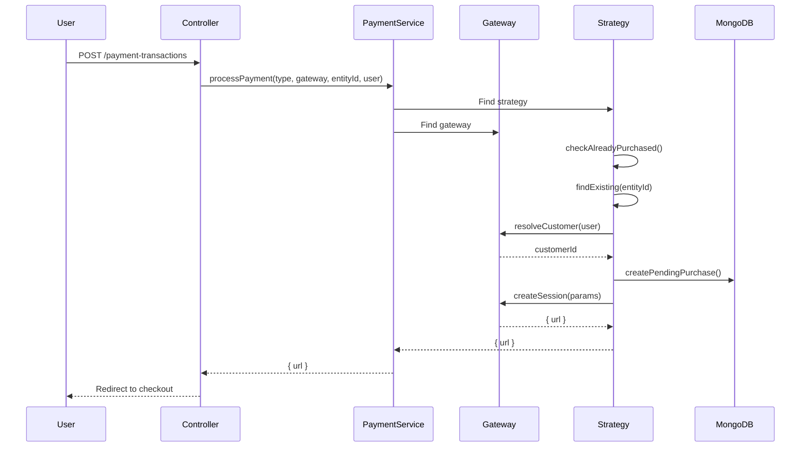

# 💳 Payment Module

**Version**: 1.0.0 (NestJS Migration)  
**Author**: Senior Engineering Team  
**Migration Date**: 26-03-29  
**Status**: ✅ **COMPLETE**

---

## 📌 Overview

The **Payment Module** is a comprehensive payment processing system built with the **Strategy** and **Gateway** design patterns, enabling flexible multi-provider payment processing with complete transaction tracking and webhook handling.

### **Business Value**

- **Revenue Generation**: Process payments via Stripe (web) and RevenueCat (mobile)
- **Multiple Gateways**: Support Stripe, RevenueCat, SSLCommerz with easy extensibility
- **Transaction Tracking**: Full audit trail for all payments with gateway responses
- **Earnings Dashboard**: Real-time revenue analytics with growth metrics
- **Stripe Connect**: Enable business users to accept payments
- **Subscription Lifecycle**: Handle purchases, renewals, cancellations, refunds
- **Webhook Automation**: Automatic transaction updates from payment providers

---

## 🎯 Responsibilities

1. **Payment Processing**
   - Strategy-based purchase handling
   - Multi-gateway support (Stripe, RevenueCat)
   - Checkout session creation
   - Customer resolution/creation

2. **Transaction Management**
   - Complete transaction audit trail
   - Status tracking (pending → processing → completed/failed/refunded)
   - Gateway response storage
   - RevenueCat integration

3. **Earnings Aggregation**
   - Real-time revenue statistics
   - Daily/weekly/monthly/quarterly/yearly breakdowns
   - Growth percentage calculations
   - Pending/processing amount tracking

4. **Stripe Connect**
   - Business user onboarding
   - Account status tracking
   - Onboarding link generation

5. **Webhook Handling**
   - Stripe webhook processing (7 event types)
   - RevenueCat webhook processing (7 event types)
   - Signature verification
   - Idempotency checks
   - Event logging and retry

---

## 📁 Module Structure

```
payment.module/
├── payment.module.ts                      # Parent module
├── payment/
│   ├── payment.service.ts                 # Orchestration service
│   ├── payment.constants.ts               # Enums & configuration
│   ├── gateways/
│   │   ├── payment.gateway.interface.ts   # Gateway contract
│   │   └── stripe.gateway.ts              # Stripe implementation
│   └── strategies/
│       └── purchase.strategy.ts           # Strategy pattern base
├── paymentTransaction/
│   ├── paymentTransaction.module.ts
│   ├── schemas/paymentTransaction.schema.ts
│   ├── dto/paymentTransaction.dto.ts
│   ├── services/paymentTransaction.service.ts
│   └── controllers/paymentTransaction.controller.ts
├── stripeAccount/
│   ├── stripeAccount.module.ts
│   ├── schemas/stripeAccount.schema.ts
│   ├── services/stripeAccount.service.ts
│   └── controllers/stripeAccount.controller.ts
├── stripeWebhook/
│   ├── stripeWebhook.module.ts
│   ├── schemas/stripeWebhookEvent.schema.ts
│   ├── services/stripeWebhook.service.ts
│   └── controllers/stripeWebhook.controller.ts
└── revenueCatWebhook/
    ├── revenueCatWebhook.module.ts
    ├── schemas/revenueCatWebhookEvent.schema.ts
    ├── services/revenueCatWebhook.service.ts
    └── controllers/revenueCatWebhook.controller.ts
```

---

## 🔌 API Endpoints

### **PaymentTransaction** (8 endpoints)

| Method | Endpoint | Auth | Role | Description |
|--------|----------|------|------|-------------|
| `GET` | `/payment-transactions` | ✅ | Admin | Get all with pagination |
| `GET` | `/payment-transactions/debug` | ✅ | Admin | Get all with gateway response |
| `GET` | `/payment-transactions/earnings/overview` | ✅ | Admin | Earnings dashboard |
| `GET` | `/payment-transactions/user/:userId` | ✅ | Any | User's transactions |
| `GET` | `/payment-transactions/:id` | ✅ | Any | Transaction by ID |
| `POST` | `/payment-transactions` | ✅ | Admin | Create transaction |
| `PUT` | `/payment-transactions/:id/status` | ✅ | Admin | Update status |
| `DELETE` | `/payment-transactions/:id` | ✅ | Admin | Delete transaction |

### **StripeAccount** (5 endpoints)

| Method | Endpoint | Auth | Role | Description |
|--------|----------|------|------|-------------|
| `POST` | `/stripe-accounts/connect` | ✅ | Any | Create account + onboarding |
| `GET` | `/stripe-accounts/success/:id` | ❌ | Public | Success callback |
| `GET` | `/stripe-accounts/refresh/:id` | ❌ | Public | Refresh onboarding |
| `GET` | `/stripe-accounts/status` | ✅ | Any | Check onboarding status |

### **Webhooks** (2 endpoints)

| Method | Endpoint | Auth | Description |
|--------|----------|------|-------------|
| `POST` | `/webhooks/stripe` | ❌ | Stripe webhook handler |
| `POST` | `/webhooks/revenuecat` | ❌ | RevenueCat webhook handler |

---

## 📊 Database Schemas

### **PaymentTransaction**

```typescript
{
  userId: ObjectId → User,
  referenceFor: 'userSubscription' | 'purchasedJourney' | 'purchasedAdminCapsule',
  referenceId: ObjectId,
  paymentGateway: 'stripe' | 'paypal' | 'sslcommerz' | 'revenuecat' | 'none',
  transactionId: string,
  paymentIntent: string,
  amount: number,
  currency: 'usd' | 'bdt' | 'eur' | 'gbp',
  paymentStatus: 'pending' | 'processing' | 'completed' | 'failed' | 'refunded' | 'cancelled' | 'partially_refunded' | 'disputed',
  gatewayResponse: object,
  revenueCatOrderId: string,
  revenueCatEnvironment: 'production' | 'sandbox',
  platform: 'ios' | 'android' | 'web',
  isDeleted: boolean,
  createdAt: Date,
  updatedAt: Date
}
```

### **StripeAccount**

```typescript
{
  userId: ObjectId → User,
  accountId: string, // Stripe account ID
  isCompleted: boolean,
  createdAt: Date,
  updatedAt: Date
}
```

### **StripeWebhookEvent**

```typescript
{
  eventId: string, // Stripe event ID
  eventType: string,
  accountId: string,
  paymentIntentId: string,
  customerId: string,
  amount: number,
  currency: string,
  eventData: object,
  processingStatus: 'pending' | 'processing' | 'completed' | 'failed',
  errorMessage: string,
  attempts: number,
  createdAt: Date,
  updatedAt: Date
}
```

### **RevenueCatWebhookEvent**

```typescript
{
  eventId: string, // RevenueCat event ID
  eventType: string,
  appId: string,
  userId: string, // original_app_user_id
  productId: string,
  environment: 'production' | 'sandbox',
  eventData: object,
  processingStatus: 'pending' | 'processing' | 'completed' | 'failed',
  errorMessage: string,
  attempts: number,
  createdAt: Date,
  updatedAt: Date
}
```

---

## 🔄 System Flow

### **Payment Processing Flow**



### **Webhook Processing Flow**

```mermaid
sequenceDiagram
    participant SP as Stripe/RevenueCat
    participant WH as WebhookController
    participant WS as WebhookService
    participant DB as MongoDB
    participant PTS as PaymentTransactionService

    SP->>WH: POST /webhooks/provider
    WH->>WS: verifySignature(body, signature)
    WS-->>WH: Valid/Invalid
    WH->>WS: processEvent(event)
    WS->>DB: logWebhookEvent()
    WS->>WS: handleEventType()
    alt INITIAL_PURCHASE / checkout.session.completed
        WS->>PTS: create transaction
    alt PAYMENT_SUCCEEDED
        WS->>PTS: updateStatus(completed)
    alt PAYMENT_FAILED
        WS->>PTS: updateStatus(failed)
    alt REFUND
        WS->>PTS: updateStatus(refunded)
    end
    WS-->>WH: Success
    WH-->>SP: 200 OK
```

---

## 🚀 Performance Considerations

### **Caching Strategy**

| Cache Key | TTL | Purpose |
|-----------|-----|---------|
| `payment:transaction:{id}` | 5 min | Transaction detail |
| `payment:user:{userId}` | 5 min | User's transactions |
| `payment:earnings:summary` | 10 min | Earnings overview |

### **Database Optimization**

- ✅ Compound indexes on userId + status
- ✅ Indexes on referenceFor + referenceId
- ✅ Indexes on paymentGateway + transactionId
- ✅ Indexes on revenueCatOrderId
- ✅ Date-based indexes for reports

### **Webhook Optimization**

- ✅ Event logging with unique constraint (idempotency)
- ✅ Processing status tracking
- ✅ Retry mechanism for failed events
- ✅ Async processing (don't block webhook response)

---

## 🔐 Security & Access Control

### **Role-Based Access**

| Endpoint | User | Admin | Public |
|----------|------|-------|--------|
| Create transaction | ❌ | ✅ | ❌ |
| Get all transactions | ❌ | ✅ | ❌ |
| Get user transactions | ✅ Own | ✅ All | ❌ |
| Get earnings overview | ❌ | ✅ | ❌ |
| Update status | ❌ | ✅ | ❌ |
| Webhooks | ❌ | ❌ | ✅ (signature verified) |

### **Webhook Security**

- ✅ HMAC-SHA256 signature verification
- ✅ Secret management via ConfigService
- ✅ Idempotency via unique eventId
- ✅ Event logging for audit

---

## 📝 Express → NestJS Transition

### **Pattern Changes**

| Express | NestJS |
|---------|--------|
| `new PaymentService()` | Constructor DI |
| `stripe.paymentIntents.create()` | StripeGateway with DI |
| `GenericController` | Custom controller |
| `sendResponse(res, {...})` | Return value |
| `catchAsync()` | Built-in async/await |
| Manual signature verification | Service method |

### **Architecture Improvements**

1. **Strategy Pattern** - Clean separation of purchase types
2. **Gateway Pattern** - Easy to add new payment providers
3. **Dependency Injection** - Testable, maintainable
4. **DTOs** - Type-safe validation
5. **Module System** - Clear boundaries
6. **Webhook Event Logging** - Complete audit trail

---

## 🧪 Testing Checklist

- [ ] Payment flow end-to-end
- [ ] Stripe checkout session creation
- [ ] Transaction creation and updates
- [ ] Earnings aggregation accuracy
- [ ] Stripe Connect onboarding
- [ ] Stripe webhook signature verification
- [ ] RevenueCat webhook signature verification
- [ ] Webhook event processing (all types)
- [ ] Idempotency (duplicate events)
- [ ] Rate limiting
- [ ] Role-based access control

---

## 🔗 Related Modules

- **User Module**: User records for payment tracking
- **Subscription Module**: Subscription plans and user subscriptions
- **Notification Module**: Payment confirmation notifications

---

## 📚 References

- **Express Source**: `/task-management-backend-template/src/modules/payment.module/`
- **Stripe Docs**: https://stripe.com/docs/api
- **RevenueCat Docs**: https://docs.revenuecat.com/docs/webhooks
- **Strategy Pattern**: https://refactoring.guru/design-patterns/strategy
- **Gateway Pattern**: https://refactoring.guru/design-patterns/strategy

---

**Last Updated**: 26-03-29  
**Next Review**: After production deployment

---
-26-03-29
