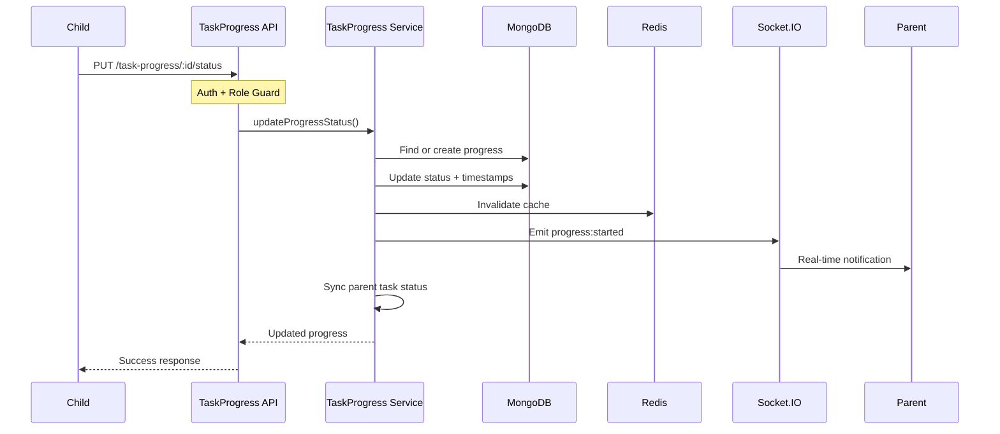
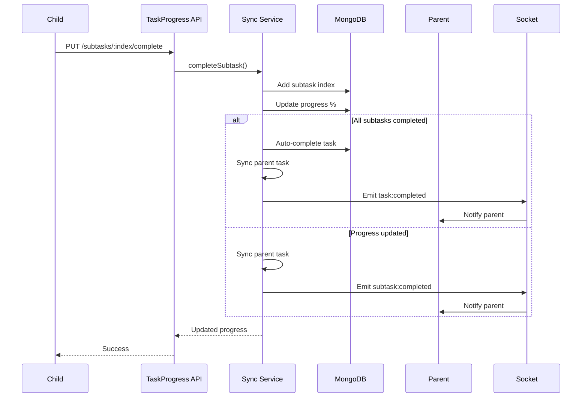
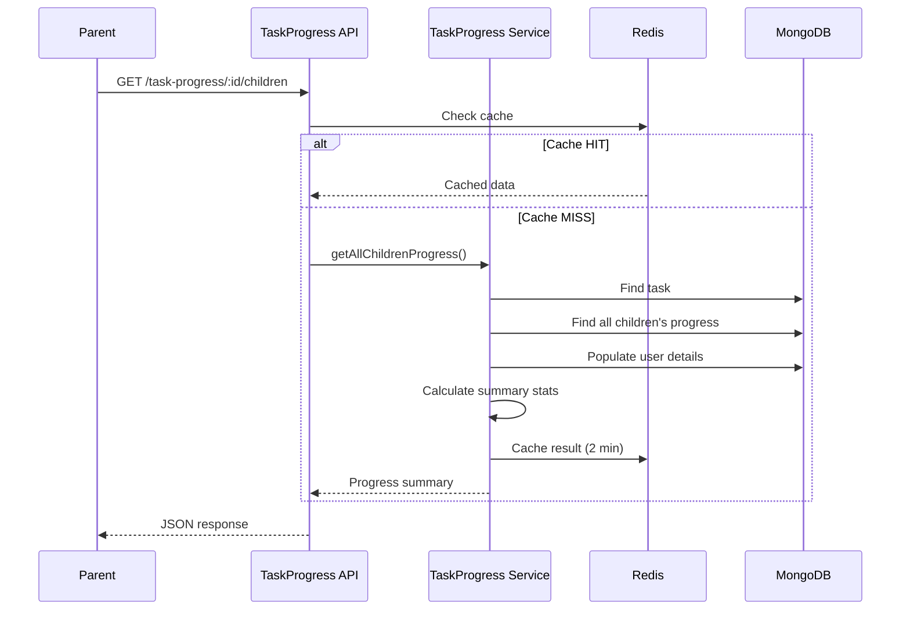

# 📊 TaskProgress Module

**Version**: 1.0.0 (NestJS Migration)  
**Author**: Senior Engineering Team  
**Migration Date**: 26-03-29  
**Status**: ✅ Complete

---

## 📌 Overview

The **TaskProgress module** tracks each child's independent progress on collaborative tasks, enabling parents to monitor real-time progress across multiple children.

### **Business Value**

- **Parent Visibility**: See which children have started, are working on, or completed tasks
- **Individual Accountability**: Each child has their own progress record
- **Real-Time Updates**: Parents receive instant notifications when children make progress
- **Automatic Sync**: Parent task status auto-updates based on all children's progress

---

## 🎯 Responsibilities

1. **Per-Child Progress Tracking**
   - Track status: `notStarted` → `inProgress` → `completed`
   - Monitor progress percentage (0-100%)
   - Record completed subtask indexes

2. **Subtask Completion**
   - Track which subtasks each child completed
   - Auto-update progress percentage
   - Auto-complete task when all subtasks done

3. **Parent Task Auto-Sync**
   - When ALL children complete → parent task auto-completed
   - When ANY child starts → parent task → inProgress
   - Real-time status synchronization

4. **Real-Time Notifications**
   - Socket.IO events to parents
   - Family activity feed broadcasts
   - Web notifications

5. **Performance Optimization**
   - Redis caching (2-5 min TTL)
   - Strategic database indexes
   - Cache invalidation on writes

---

## 📁 Module Structure

```
taskProgress/
├── taskProgress.module.ts          # Module definition
├── taskProgress.controller.ts      # HTTP request handlers (6 endpoints)
├── taskProgress.service.ts         # Business logic
├── taskProgress.schema.ts          # Mongoose schema
├── taskProgress.constants.ts       # Enums and configuration
├── dto/
│   └── taskProgress.dto.ts         # Validation DTOs
├── entities/
│   └── taskProgress.entity.ts      # TypeScript entities
└── doc/
    ├── dia/                        # Mermaid diagrams
    ├── perf/                       # Performance reports
    └── README.md                   # This file
```

---

## 🔌 API Endpoints

### **Child Endpoints**

| Method | Endpoint | Description | Auth | Rate Limit |
|--------|----------|-------------|------|------------|
| `GET` | `/task-progress/:taskId/user/:userId` | Get personal progress | Child | 100/min |
| `PUT` | `/task-progress/:taskId/status` | Update status (start/complete) | Child | 30/min |
| `PUT` | `/task-progress/:taskId/subtasks/:subtaskIndex/complete` | Mark subtask complete | Child | 30/min |

### **Parent Endpoints**

| Method | Endpoint | Description | Auth | Rate Limit |
|--------|----------|-------------|------|------------|
| `GET` | `/task-progress/:taskId/children` | Get all children's progress | Parent | 100/min |
| `GET` | `/task-progress/child/:childId/tasks` | Get child's all tasks | Parent | 100/min |

### **Admin Endpoints**

| Method | Endpoint | Description | Auth | Rate Limit |
|--------|----------|-------------|------|------------|
| `DELETE` | `/task-progress/:taskId/user/:userId` | Delete progress (soft) | Admin | 10/min |

---

## 📊 Database Schema

### **TaskProgress Collection**

```typescript
{
  _id: ObjectId,
  taskId: ObjectId → Task,
  userId: ObjectId → User,
  status: 'notStarted' | 'inProgress' | 'completed',
  startedAt?: Date,
  completedAt?: Date,
  completedSubtaskIndexes: number[],
  progressPercentage: number (0-100),
  note?: string (max 500 chars),
  isDeleted: boolean,
  createdAt: Date,
  updatedAt: Date
}
```

### **Indexes**

```javascript
// Primary query (unique constraint)
{ taskId: 1, userId: 1 } with partialFilterExpression: { isDeleted: false }

// Parent dashboard
{ taskId: 1, status: 1, isDeleted: 1 }

// Child's task list
{ userId: 1, status: 1, isDeleted: 1 }

// Activity feed
{ updatedAt: -1, isDeleted: 1 }
```

---

## 🔄 System Flow

### **Child Starts Task**



### **Child Completes Subtask**



### **Parent Views All Children's Progress**



---

## 🚀 Performance Considerations

### **Caching Strategy**

| Cache Key | TTL | Purpose |
|-----------|-----|---------|
| `taskProgress:detail:task:{id}:user:{uid}` | 5 min | Individual progress |
| `taskProgress:children:task:{id}` | 2 min | Parent dashboard |
| `taskProgress:tasks:user:{uid}` | 3 min | Child's task list |
| `taskProgress:summary:task:{id}` | 2 min | Summary statistics |

### **Cache Invalidation**

Cache is invalidated on:
- Progress status update
- Subtask completion
- Progress deletion

### **Database Optimization**

- ✅ Compound indexes for common queries
- ✅ Partial filter indexes (exclude deleted)
- ✅ Virtual populate for user/task details
- ✅ `.lean()` on read queries

---

## 🔐 Security & Access Control

### **Role-Based Access**

| Endpoint | Child | Parent | Admin |
|----------|-------|--------|-------|
| Get personal progress | ✅ Own only | ❌ | ✅ |
| Get all children's progress | ❌ | ✅ Family | ✅ |
| Update status | ✅ Own only | ❌ | ✅ |
| Complete subtask | ✅ Own only | ❌ | ✅ |
| Delete progress | ❌ | ❌ | ✅ |

### **Rate Limiting**

- **Status updates**: 30 requests/minute (prevents spam)
- **Subtask completion**: 30 requests/minute
- **Read operations**: 100 requests/minute
- **Delete operations**: 10 requests/minute (admin only)

---

## 📝 Express → NestJS Transition

### **Pattern Changes**

| Express | NestJS |
|---------|--------|
| `router.get('/:taskId/children')` | `@Get(':taskId/children')` |
| `auth(TRole.business)` | `@UseGuards(AuthGuard, RolesGuard)` + `@Roles('business')` |
| `validateRequest(zodSchema)` | DTOs with `class-validator` |
| `rateLimiter('user')` | `@Throttle(30, 60)` |
| `sendResponse(res, {...})` | Return value + interceptor |
| `req.user?.userId` | `@User().userId` |
| `GenericService` | Extend `GenericService` |

### **Key Learnings**

1. **DTOs replace Zod schemas** - More type-safe, integrated with NestJS
2. **Decorators replace middleware** - Cleaner, more testable
3. **Dependency injection** - No manual service instantiation
4. **Guards are composable** - Auth + Roles stack easily
5. **Interceptors standardize responses** - No manual sendResponse

---

## 🧪 Testing Checklist

- [ ] Child can view own progress
- [ ] Parent can view all children's progress
- [ ] Child can update status (start/complete)
- [ ] Child can complete subtasks
- [ ] Progress percentage calculates correctly
- [ ] Auto-complete when all subtasks done
- [ ] Parent task syncs when all children complete
- [ ] Socket.IO events emit to parent
- [ ] Redis caching works (80%+ hit rate)
- [ ] Cache invalidates on writes
- [ ] Rate limiting prevents spam
- [ ] Role-based access control works

---

## 🔗 Related Modules

- **Task Module**: Parent task entity
- **SubTask Module**: Subtask tracking
- **User Module**: Child/parent user data
- **Notification Module**: Web notifications
- **Socket.Gateway**: Real-time events

---

## 📚 References

- **Express Source**: `/task-management-backend-template/src/modules/taskProgress.module/`
- **Documentation**: `REAL_TIME_PARENT_MONITORING-12-03-26.md`
- **Figma**: `dashboard-flow-01.png`, `task-monitoring-flow-01.png`
- **Status Flow**: `status-section-flow-01.png`

---

**Last Updated**: 26-03-29  
**Next Review**: After production deployment

---
-26-03-29
